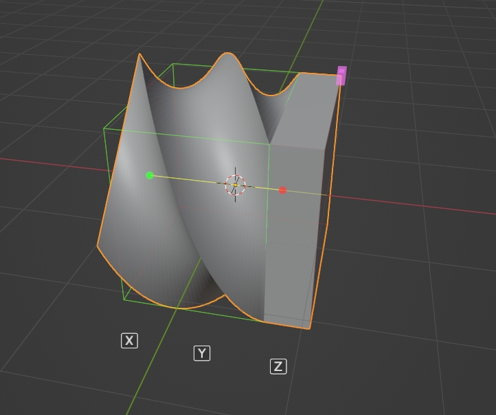

# SimpleDeformHelper
The [Chinese](https://github.com/AIGODLIKE/simple_deform_helper/blob/main/README_CN.md) readme is here

Note: Directly downloading Zip will not install and requires downloading [publishing](https://github.com/AIGODLIKE/simple_deform_helper/releases)Version

Simple Deform Modifier Visual adjustment tool

You can modify parameters more intuitively by dragging the gizmo directly

To display the gizmo, you need to select the active object and the active modifier is a simple deformation modifier

1. Angle control gizmo

You can drag to control the modifier's value

2. Axial control gizmo

Modify the deformation axis of the active modifier by clicking

Shortcut keys (when dragging the gizmo):

X Y Z: modify the modifier's deformation axis

A: Show deformation axis gizmo

Scroll wheel: switch the origin control mode

Toggle the axial gizmo (displayed only when the mode is bending):

6 directions, each direction has two directions that can be switched

While dragging the upper and lower limits gizmo, you can hold down Ctrl to maintain the relative distance between the upper and lower limits

V0.2.0 Release (May 31, 2023)
    Add:
        The display position of plug-in properties and gizmo properties can be changed, and the display position of some controllable properties of the gizmo can be changed
    Modification:
        Change the display deformation box to an optional value and do not display by default
        Change the display setting deformation axis to an optional value, default not to display
