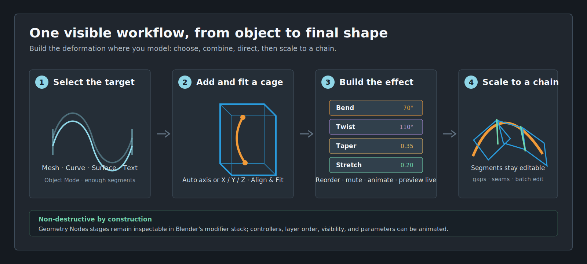
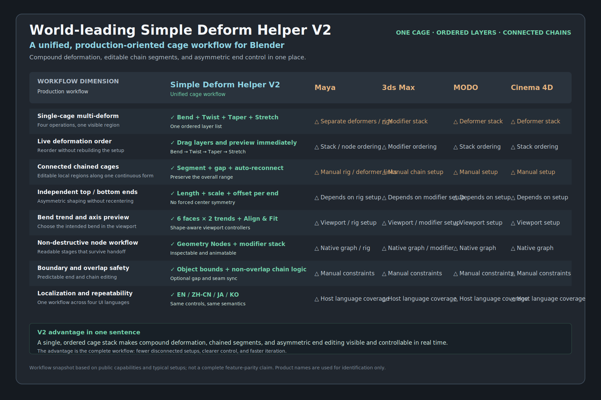

<div align="center">

# World-leading Simple Deform Helper V2

**A production-oriented deformation workflow for Blender: build compound Bend, Twist, Taper, and Stretch effects inside visible, editable cages.**

[](https://github.com/AIGODLIKE/simple_deform_helper/releases/download/v2.0.0/simple_deform_helper-2.0.0.zip)
[](https://www.blender.org/download/lts/4-2/)
[](https://github.com/AIGODLIKE/simple_deform_helper/actions/workflows/validate.yml)

[简体中文](README.zh_HANS.md) · [日本語](README.ja_JP.md) · [한국어](README.ko_KR.md) · [Releases](https://github.com/AIGODLIKE/simple_deform_helper/releases) · [Report a bug](https://github.com/AIGODLIKE/simple_deform_helper/issues/new?template=bug_report.yml)

</div>

Simple Deform Helper V2 turns a collection of modifier parameters into a direct modeling workflow. The cage shows **where** deformation happens, viewport handles show **what** will change, and an ordered layer list shows **when** each operation is evaluated.



## Why it is different

Most tools can bend an object. V2 is designed around the harder production questions: How do several deformations share one region? How do adjacent bends remain editable? How do you reshape only one end? How do you understand the result six months later?

| Production need | Simple Deform Helper V2 answer |
|---|---|
| Compound deformation | One cage can contain **Bend, Twist, Taper, and Stretch** as ordered layers. Reorder or temporarily mute a layer without rebuilding the setup. |
| Long, articulated forms | A **chained cage** divides the object into editable segments with optional gaps, automatic downstream reconnection, and synchronized shared-end scale. |
| Asymmetric shaping | Top and bottom length, X/Z scale, and X/Z offset are independent. No forced center-symmetric resize. |
| Direction discovery | **Bend Trend** exposes two bend choices on each of six faces; axis selection and **Align & Fit** keep the cage matched to the stage input. |
| Direct manipulation | Bend, Twist, Taper, Stretch, end shape, and end length have distinct viewport handles, colors, and hover names. |
| Non-destructive delivery | Geometry Nodes stages remain visible in the modifier stack, support animation, and keep working after the extension is disabled. |
| Existing Blender files | A separate **legacy Simple Deform** workflow adds stage-aware gizmos, limits, Origin control, wireframe preview, and low-topology guidance to native modifiers. |



The comparison is about the concentration of these controls in one Blender workflow, not whether another application can reproduce an individual result. Product names are used only to identify the compared workflows.

## Choose a workflow

| Use case | Start here | What it creates |
|---|---|---|
| One local or compound deformation | **Add Cage Deform** | One independent Geometry Nodes cage stage. |
| A pipe, tail, cable, horn, tentacle, or segmented body | **Add Chained Cages** | 2-8 related cage stages created and fitted in one operation. |
| Divide an existing authored cage without changing its total range | **Subdivide to Chained Cages** | A chain derived from the active cage; Bend/Twist values are distributed across segments. |
| Control Blender's native modifier directly | **Add Simple Deform (Legacy)** | A standard Simple Deform modifier with the original helper gizmos. |
| Lattice object | **Add Simple Deform (Legacy)** | Native modifier only; cage deformation is intentionally unavailable for Lattice. |

## Install

1. Download [`simple_deform_helper-2.0.0.zip`](https://github.com/AIGODLIKE/simple_deform_helper/releases/download/v2.0.0/simple_deform_helper-2.0.0.zip). Do not use GitHub's automatically generated Source code ZIP.
2. In Blender, open **Edit > Preferences > Get Extensions**.
3. Open the menu in the upper-right corner and choose **Install from Disk**.
4. Select the downloaded ZIP and enable **Simple Deform Helper V2** if Blender does not enable it automatically.
5. In the 3D View, press `N` and open the **Simple Deformer V2** tab.

For an update, install the newer release ZIP over the existing extension, then restart Blender. Save a versioned copy of important `.blend` files before updating production scenes.

## First bend in 60 seconds

1. In **Object Mode**, select a Mesh, Curve, Surface, or Text object.
2. Press `N`, open **Simple Deformer V2**, and click **Add Cage Deform**.
3. Under **Deformation Layers**, keep **Bend** selected and set **Bend Angle**.
4. Under **Cage Controls**, choose **Auto** or an explicit `X+ / X- / Y+ / Y- / Z+ / Z-` deformation axis.
5. Click **Align & Fit**. This fits against the geometry entering the active stage, not merely the object's original bounds.
6. Enable **Bend Trend** and click the outward arrow that matches the intended direction. Red and green represent the two perpendicular bend trends on a face.
7. Drag the orange Bend handle. Hold `Shift` for precision or `Ctrl` for snapping.
8. Click **Return to Object** when finished editing the controller.

If the bend looks faceted, the object needs more geometry along the deform axis. The legacy panel can add a non-destructive Simple subdivision before its active modifier; cage targets should likewise have enough evaluated segments before the cage stage.

## Build a compound deformation

A cage evaluates its enabled layers from top to bottom. Order changes the result:

```text
Object input
  -> Bend
  -> Twist
  -> Taper
  -> Stretch
  -> independent top/bottom profile
  -> cage output
```

1. Create or select a cage stage.
2. In **Deformation Layers**, click **Add Deformation** and choose Bend, Twist, Taper, or Stretch.
3. Use the up/down arrows to change execution order.
4. Use the eye button to bypass a layer temporarily; use `X` to remove it.
5. Enable **Expand All** when tuning several layer values together.
6. Select a layer to expose its matching viewport controller.

Useful starting orders:

| Goal | Suggested order | Why |
|---|---|---|
| Curved, twisted tube | Bend -> Twist | Twist follows the already curved frame. |
| Horn or nozzle | Taper -> Bend | The cross-section narrows before the centerline is bent. |
| Elastic bend | Stretch -> Bend | Length changes before curvature is evaluated. |
| Compare a variation | Mute one layer | Keeps its value and position while removing only its effect. |

## Build a chained cage

Chained cages are for a continuous form that needs several local deformation regions.

### Create a new chain

1. Select the target and click **Add Chained Cages**.
2. Choose **Cage Count** (`2-8`), **Chained** or **Independent**, a non-negative **Gap**, and the cage axis.
3. Leave **Auto Reconnect** and **Sync Shared End Scale** enabled for a continuous pipe-like result.
4. Use **Show Other Cages** to display and directly select dimmed inactive cages in the viewport.
5. Use **Align & Fit Chain** after changing the deformation axis or when the chain needs to be refitted to its evaluated input.

### Subdivide an existing cage

Select a single cage with **Bottom** Origin, then choose **Subdivide to Chained Cages**. The original outer boundaries are preserved, requested gaps are clamped to fit the range, and Bend/Twist angles are distributed across the new segments. Animated cage parameters are not subdivided automatically because that would be ambiguous.

### Edit several segments at once

Open **Batch Edit** and choose the whole chain, start-to-active, or active-to-end. You can edit end scale, end offset, gaps, a deformation parameter, or stage visibility. Values preview live while the dialog is open; cancelling restores the captured chain state.

### Connection behavior

- **Auto Reconnect** propagates an upstream output frame to downstream cages after parameter or controller changes.
- **Sync Shared End Scale** changes both sides of a shared seam together while leaving the two outer chain ends independent.
- **Gap Before** permits intentional separation. Interior boundaries cannot overlap; the overall range is preserved where possible.
- **Chained** continues from the preceding stage and keeps the untouched prefix stable. **Independent** limits each segment to its own box.

## Viewport control reference

| Handle | Meaning | Interaction |
|---|---|---|
| Orange double arrow | Bend angle | Drag; `Shift` precision; `Ctrl` snap. |
| Small orange direction handle | Fine Bend direction | Enable **Fine Direction**, then drag. |
| Large purple arc | Twist angle | Drag around its center; the angle continues cleanly across the seam. |
| Amber handle | Taper factor | Drag; `Shift` precision; `Ctrl` snap. |
| Green handle | Stretch factor | Drag; `Shift` precision; `Ctrl` snap. |
| Yellow top / amber bottom | Move only one cage boundary | Drag along the cage axis; bounds stop at the input object when **Limit to Object Bounds** is on. |
| Cyan top / green bottom | Shape only one end | Drag for cross-section scale; hold `Alt` to slide in local X; `Shift` precision; `Ctrl` snap. |
| Red / green trend arrows | Horizontal / vertical Bend trend | Click to choose and close; `Ctrl` keeps all choices visible. |
| RGB diamond / ring | Positive / negative X, Y, or Z axis | Click to change axis; diamond is positive, ring is negative. |

Hover a handle to see its function name. Controllers and managed helper objects are kept in the **Simple Deform Controls** collection and hidden unless they are needed. Relationship lines are suppressed for managed helpers.

## Cage settings

### Spatial mode

| Mode | Outside the cage |
|---|---|
| **Limited** | Deformation is evaluated inside the cage and continued from its ends. |
| **Within Box** | Only points inside the cage are affected. |
| **Unlimited** | Deformation continues beyond the cage. |
| **Chained** | The incoming prefix remains unchanged and the result continues from the cage end; used by connected chains. |

### Origin

| Origin | Behavior |
|---|---|
| **Bottom** | Starts from the lower cage boundary; required by connected chain flow. |
| **Center** | Uses signed distance from the cage center. |
| **Symmetric** | Mirrors the profile across the cage center. |
| **Top** | Starts from the upper cage boundary. |

### Independent ends

Use **Top/Bottom Scale X/Z** and **Top/Bottom Offset X/Z** for a non-symmetric profile. Length handles move one boundary while compensating the cage center so the opposite boundary stays fixed. **Reset Independent Ends** restores the fitted cross-section.

## Multiple cage stages

- Each cage is a separate, reorderable modifier stage with its own controller and layer list.
- New cage stages are added at the end of the modifier stack by default. Change **Add New Cages to End** in extension preferences if another insertion behavior is required.
- The stage monitor button temporarily bypasses the complete cage while preserving chain bookkeeping.
- **Duplicate** creates an independently owned stage. Duplicated target objects detach their managed node groups and controllers before editing.
- **Remove Stage** deletes one stage and its owned helper. **Remove Cage Stack** removes every managed cage from the target.
- **Show Other Cages** is enabled by default, so inactive cages remain visible, dimmed, selectable, and directly editable while the target is selected.

## Legacy Simple Deform workflow

The legacy section does not convert the modifier into a cage. It improves Blender's native Simple Deform workflow:

- real stage selection when several Simple Deform modifiers exist;
- previous/next stage navigation and optional bounds for other stages;
- direct Angle/Factor, Limits, Origin, axis, and Bend-direction gizmos;
- optional evaluated wireframe preview with configurable refresh rate;
- animation keyframe insertion/removal for the active stage;
- low-topology warning and one-click non-destructive subdivision;
- Mesh, Curve, Surface, Text, and Lattice entry points where Blender supports the native modifier.

During a legacy gizmo drag: mouse wheel switches Origin control mode, `X/Y/Z` changes deform axis, `W` toggles wireframe preview, and `A` enters Bend-axis selection when applicable.

## Compatibility

| Item | Support |
|---|---|
| Blender | **4.2 LTS and newer**; CI validates the minimum LTS and current supported release. |
| Cage targets | Mesh, Curve, Surface, and Text. Surface targets may be prepared internally for Geometry Nodes compatibility. |
| Lattice | Legacy Simple Deform only; the panel shows an explicit cage-not-supported notice. |
| Deformation engine | Blender Geometry Nodes for cages; Blender Simple Deform for legacy mode. |
| Languages | English, Simplified Chinese, Japanese, and Korean UI catalogs. |
| Animation | Cage parameters, layer values, transforms, stage visibility, and legacy modifier properties. |
| Saved results | Generated node stages remain in the file and continue evaluating without the extension; custom UI and controller maintenance require the extension. |

## Troubleshooting

| Symptom | Check |
|---|---|
| No **Simple Deformer V2** tab | Confirm the extension is enabled, use a 3D View, press `N`, and restart Blender once after replacing an older build. |
| Add Cage Deform has no effect | Select a supported object in Object Mode. If a copied object lost its Geometry Nodes stage, remove the stale managed stage and add a new cage. |
| Bend is faceted | Add evaluated segments along the deform axis before the cage stage. |
| Cage no longer matches the object | Select the intended stage, set its axis, then use **Align & Fit** or **Align & Fit Chain**. |
| Chain has a discontinuity | Enable **Auto Reconnect**, use **Reconnect Chain**, and check **Gap Before** plus shared-end scale. |
| The bottom of a chain moves unexpectedly | Confirm stages remain in chain order and use **Chained** mode with **Bottom** Origin. Reconnect before adjusting downstream segments. |
| A handle is missing | Select the target or cage, select the relevant deformation layer, and enable the corresponding Bend Trend, Fine Direction, end, or length handle option. |
| Controls remain visible with nothing selected | Deselect all, then switch viewport mode or reselect/deselect once. If it persists, attach a minimal file to a bug report. |
| Lattice cannot add a cage | This is intentional; use **Add Simple Deform (Legacy)**. |

## Data and removal

Removing a cage stage deletes the managed Geometry Nodes modifier and helper objects owned by that stage. Removing the extension does **not** automatically remove generated node groups from existing `.blend` files. To clean a file, use **Remove Cage Stack** before uninstalling and save a new copy.

## Feedback and contributions

Use the [bug report form](https://github.com/AIGODLIKE/simple_deform_helper/issues/new?template=bug_report.yml) and include:

- Simple Deform Helper and Blender versions;
- operating system, GPU, and input device;
- exact reproduction steps and modifier order;
- console output;
- a minimal, privacy-safe `.blend` file or short video.

Pull requests should keep the extension compatible with Blender 4.2 LTS, avoid third-party runtime dependencies, update all four translation catalogs for user-facing text, and pass the repository validation workflow.

## License

Simple Deform Helper V2 is distributed under **GPL-3.0-or-later**, as declared in [`blender_manifest.toml`](blender_manifest.toml). Maya, 3ds Max, MODO, Cinema 4D, Blender, and their marks belong to their respective owners and are mentioned only for identification and workflow comparison.
