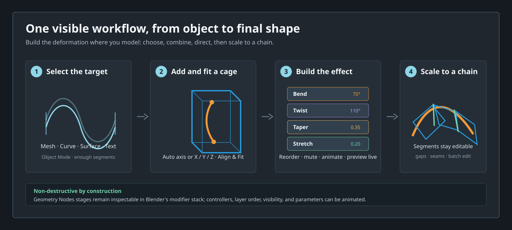
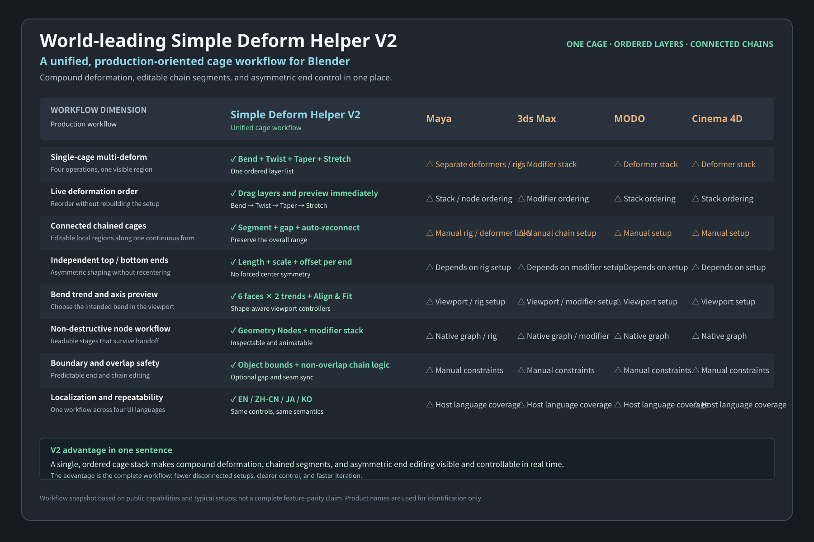

<div align="center">

# World-leading Simple Deform Helper V2

**A production-oriented deformation workflow for Blender: build compound Bend, Twist, Taper, and Stretch effects inside visible, editable cages.**

[](https://github.com/AIGODLIKE/simple_deform_helper/releases/download/v2.4.6/simple_deform_helper-2.4.6.zip)
[](https://www.blender.org/download/)
[](https://github.com/AIGODLIKE/simple_deform_helper/actions/workflows/validate.yml)

[简体中文](README.zh_HANS.md) · [日本語](README.ja_JP.md) · [한국어](README.ko_KR.md) · [Releases](https://github.com/AIGODLIKE/simple_deform_helper/releases) · [Report a bug](https://github.com/AIGODLIKE/simple_deform_helper/issues/new?template=bug_report.yml)

</div>

Simple Deform Helper V2 turns a collection of modifier parameters into a direct modeling workflow. The cage shows **where** deformation happens, viewport handles show **what** will change, and an ordered layer list shows **when** each operation is evaluated.



## Why it is different

Most tools can bend an object. V2 is designed around the harder production questions: How do several deformations share one region? How do adjacent bends remain editable? How do you reshape only one end? How do you understand the result six months later?

| Production need | Simple Deform Helper V2 answer |
|---|---|
| Compound deformation | One **Standard Type** cage can contain ordered **Bend, Twist, Taper, and Stretch** layers. Reorder, mute, or key them without rebuilding the setup. |
| Long, articulated forms | A **chained cage** divides the object into editable segments with optional gaps, automatic downstream reconnection, and synchronized shared-end scale. |
| Asymmetric shaping | Top and bottom length, X/Z scale, and X/Z offset are independent. No forced center-symmetric resize. |
| Direction discovery | **Bend Trend** exposes two bend choices on each of six faces; axis selection and **Align & Fit** keep the cage matched to the stage input. |
| Direct manipulation | Bend, Twist, Taper, Stretch, Shear, FFD corners, end shape, and end length have distinct viewport handles, colors, and hover names. |
| Non-destructive delivery | Geometry Nodes stages remain visible in the modifier stack, support animation, and keep working after the extension is disabled. |
| Existing Blender files | A separate **legacy Simple Deform** workflow adds stage-aware gizmos, limits, Origin control, wireframe preview, and low-topology guidance to native modifiers. |



The comparison is about the concentration of these controls in one Blender workflow, not whether another application can reproduce an individual result. Product names are used only to identify the compared workflows.

## Choose a workflow

| Use case | Start here | What it creates |
|---|---|---|
| One local or compound deformation | **Add Cage Deform** | One independent Geometry Nodes cage stage. |
| A pipe, tail, cable, horn, tentacle, or segmented body | **Add Chained Cages** | 2-8 related cage stages created and fitted in one operation. |
| Divide an existing authored cage without changing its total range | **Subdivide to Chained Cages** | A chain derived from the active cage; Bend/Twist values are distributed across segments. |
| A dedicated cross-section slide | **Add Shear Cage** | One Shear-only cage with its own cyan handle; it is intentionally not chainable. |
| A dense free-form edit | **Add FFD Cage** | A native multi-point lattice cage with 2-6 points on each axis (up to 6x6x6). Select a group of points and move them together; it is intentionally not chainable. |
| Control Blender's native modifier directly | **Add Simple Deform (Legacy)** | A standard Simple Deform modifier with the original helper gizmos. |
| Lattice object | **Add Simple Deform (Legacy)** | Native modifier only; cage deformation is intentionally unavailable for Lattice. |

## Install

1. Download [`simple_deform_helper-2.4.6.zip`](https://github.com/AIGODLIKE/simple_deform_helper/releases/download/v2.4.6/simple_deform_helper-2.4.6.zip). Do not use GitHub's automatically generated Source code ZIP.
2. In Blender, open **Edit > Preferences > Get Extensions**. Before using the GitHub ZIP, uninstall the old **Simple Deform Helper** copy from the **Blender Extensions** repository. If **Simple Deform Helper V2** is already installed in **User Default**, leave that copy in place; this ZIP replaces it.
3. Fully quit and restart Blender so no classes from the removed copy remain loaded.
4. Open **Get Extensions**, choose **Install from Disk**, select **User Default** as the repository, and select the ZIP.
5. Enable **Simple Deform Helper** if Blender does not enable it automatically.
6. In the 3D View, press `N` and open the **Simple Deformer V2** tab.

Keep only one repository copy. The extension ID and extension-list name remain `simple_deform_helper` and **Simple Deform Helper**, but Blender treats the same ID in **Blender Extensions** and **User Default** as two separate modules. Once this version is published on the original Blender Extensions listing, use Blender's **Update** action instead of the GitHub ZIP for an in-place official update. Save a versioned copy of important `.blend` files before updating production scenes.

## First bend in 60 seconds

1. In **Object Mode**, select a Mesh, Curve, Surface, or Text object.
2. Press `N`, open **Simple Deformer V2**, and click **Add Cage Deform**.
3. Under **Deformation Layers**, keep **Bend** selected and set **Bend Angle**.
4. Under **Cage Controls**, choose **Auto** or an explicit `X+ / X- / Y+ / Y- / Z+ / Z-` deformation axis.
5. Click **Align & Fit**. This fits against the geometry entering the active stage, not merely the object's original bounds.
6. Enable **Bend Trend** and click the outward arrow that matches the intended direction. Red and green represent the two perpendicular bend trends on a face.
7. Drag the orange Bend handle. Hold `Shift` for precision or `Ctrl` for snapping.
8. Click **Return to Object** when finished editing the controller.

To animate the setup, use **Insert Keys** in the cage panel. It keys the active
layer parameters, end profiles, Shear/FFD values, cage size, and transform on
the current frame; **Delete Keys** removes those channels at the current frame.

If the bend looks faceted, add geometry along the deform axis before the cage stage. The panel reports low topology but does not insert a hidden pre-deform subdivision modifier.

## Merge several objects for one deformation

1. Select two or more Mesh, Curve, Surface, Text, Metaball, Curves, or Point Cloud objects.
2. At the top of **Simple Deformer V2**, click **Merge Selected for Deform**. Non-mesh sources are converted to meshes; the original source objects remain linked and update the merge live.
3. Add **Cage Deform**, chained cages, or other modifiers to the generated merged object.
4. Double-click a visible part of the merged result to select that source object. It appears as an in-front wire object while you edit its own modifier stack.
5. While a source is being edited, the blue preview outline shows that source after the merged object's complete modifier stack. Toggle **Show Final Merged State While Editing Sources** in Add-on Preferences to disable it.
6. Use **Add Cage to Final Source** to fit a new cage to the selected source after the merged object's current modifier stack. The stage is source-masked, so the other merged sources remain unchanged.
7. The **Merged Sources** list stays visible while editing. Click a row to switch sources; the viewport session also accepts a double-click on another part, a double-click on empty space to return, or `Esc`/right mouse to exit.
8. Use **Return to Merged Object** to hide the source again, or the unlink button to remove the generated merge and restore source visibility.

The source identity is preserved through later cage deformation, so editing remains available after the merged object has been bent, twisted, tapered, or stretched.

## Build a compound deformation

A cage evaluates its enabled layers from top to bottom. Order changes the result:

```text
Object input
  -> Bend
  -> Twist
  -> Taper
  -> Stretch
  -> independent top/bottom profile
  -> cage output
```

1. Create or select a cage stage.
2. In **Deformation Layers**, click **Add Deformation** and choose Bend, Twist, Taper, or Stretch.
3. Use the up/down arrows to change execution order.
4. Use the eye button to bypass a layer temporarily; use `X` to remove it.
5. Enable **Expand All** when tuning several layer values together.
6. Select a layer to expose its matching viewport controller.

Useful starting orders:

| Goal | Suggested order | Why |
|---|---|---|
| Curved, twisted tube | Bend -> Twist | Twist follows the already curved frame. |
| Horn or nozzle | Taper -> Bend | The cross-section narrows before the centerline is bent. |
| Elastic bend | Stretch -> Bend | Length changes before curvature is evaluated. |
| Compare a variation | Mute one layer | Keeps its value and position while removing only its effect. |

### Dedicated Shear and FFD cages

Enable **Symmetry** in an FFD layer and choose the cage-local `U`, `V`, or `W`
center plane to mirror point, line, and face edits. The active side drives the
corresponding mirrored side during move, rotate, and scale operations.

Use **Add Shear Cage** for a lateral cross-section slide. Its cyan end-plane handle supports free planar dragging, `Alt` for cage X, `Shift` for cage Z, and `Ctrl` snapping. Use **Add FFD Cage** for a native lattice that starts at `2x2x2` (eight points), supports `2-6` points on each axis (up to `6x6x6`), and keeps the panel compact. Use **Box Select** or All/None/Invert, then drag any selected point to move the selected group. **Hollow FFD** hides and excludes interior points. These dedicated cages cannot be chained or subdivided; choose **Add Cage Deform** for an ordered Standard Type stack.

## Build a chained cage

Chained cages are for a continuous form that needs several local deformation regions.

### Create a new chain

1. Select the target and click **Add Chained Cages**.
2. Choose **Cage Count** (`2-8`), **Chained** or **Independent**, a non-negative **Gap**, and the cage axis.
3. Leave **Auto Reconnect** and **Sync Shared End Scale** enabled for a continuous pipe-like result.
4. Use **Show Other Cages** to display and directly select dimmed inactive cages in the viewport.
5. Use **Align & Fit Chain** after changing the deformation axis or when the chain needs to be refitted to its evaluated input.

### Subdivide an existing cage

Select a single Standard Type cage, then choose **Subdivide to Chained Cages**. The original outer boundaries and interpolated top/bottom scale and offset profile are preserved, requested gaps are clamped to fit the range, and Bend/Twist values are distributed across the new segments. **Bottom** Origin is recommended; other Origins are accepted with a warning because mixed operations may introduce approximation error. Animated cage parameters are not subdivided automatically because their intent is ambiguous.

### Edit several segments at once

Open **Batch Edit** and choose the whole chain, start-to-active, or active-to-end. You can edit end scale, end offset, gaps, a deformation parameter, or stage visibility. Values preview live while the dialog is open; cancelling restores the captured chain state.

### Connection behavior

- **Auto Reconnect** propagates an upstream output frame to downstream cages after parameter or controller changes.
- **Sync Shared End Scale** changes both sides of a shared seam together while leaving the two outer chain ends independent.
- **Gap Before** permits intentional separation. Interior boundaries cannot overlap; the overall range is preserved where possible.
- **Chained** continues from the preceding stage and keeps the untouched prefix stable. **Independent** limits each segment to its own box.

## Viewport control reference

| Handle | Meaning | Interaction |
|---|---|---|
| Orange double arrow | Bend angle | Drag; `Shift` precision; `Ctrl` snap. |
| Large orange direction ring | Bend direction ring | Enable **Show Twist**, then drag. |
| Large purple arc | Twist angle | Drag around its center; the angle continues cleanly across the seam. |
| Amber handle | Taper factor | Drag; `Shift` precision; `Ctrl` snap. |
| Green handle | Stretch factor | Drag; `Shift` precision; `Ctrl` snap. |
| Yellow top / amber bottom | Move only one cage boundary | Drag along the cage axis; bounds stop at the input object when **Limit to Object Bounds** is on. |
| Cyan top crown / green bottom tray | Shape only one end | Drag to scale; `Alt` moves screen X; `Shift` moves screen Y; `Alt+Shift` moves freely; `Ctrl` snaps. |
| Cyan four-way plane handle | Shear cross-sections | Drag in the evaluated end plane; `Alt` locks cage X; `Shift` locks cage Z; `Ctrl` snaps. |
| Pink/cyan FFD points | Free-form control points | Drag selected points together; use **Box Select** or All/None/Invert for groups. |
| Red / green trend arrows | Horizontal / vertical Bend trend | Click to choose and close; `Ctrl` keeps all choices visible. |
| RGB diamond / ring | Positive / negative X, Y, or Z axis | Click to change axis; diamond is positive, ring is negative. |

Hover a handle to see its function name. Controllers and managed helper objects are kept in the **Simple Deform Controls** collection and hidden unless they are needed. Relationship lines are suppressed for managed helpers.

## Cage settings

### Spatial mode

| Mode | Outside the cage |
|---|---|
| **Limited** | Deformation is evaluated inside the cage and continued from its ends. |
| **Within Box** | Only points inside the cage are affected. |
| **Unlimited** | Deformation continues beyond the cage. |
| **Chained** | The incoming prefix remains unchanged and the result continues from the cage end; used by connected chains. |

### Origin

| Origin | Behavior |
|---|---|
| **Bottom** | Starts from the lower cage boundary; required by connected chain flow. |
| **Center** | Uses signed distance from the cage center. |
| **Symmetric** | Mirrors the profile across the cage center. |
| **Top** | Starts from the upper cage boundary. |

### Independent ends

Use **Top/Bottom Scale X/Z** and **Top/Bottom Offset X/Z** for a non-symmetric profile. Length handles move one boundary while compensating the cage center so the opposite boundary stays fixed. **Reset Independent Ends** restores the fitted cross-section.

## Multiple cage stages

- Each cage is a separate, reorderable modifier stage with its own controller and layer list.
- New cage stages are added at the end of the modifier stack by default. Change **Add New Cages to End** in extension preferences if another insertion behavior is required.
- The stage monitor button temporarily bypasses the complete cage while preserving chain bookkeeping.
- **Duplicate** creates an independently owned stage. Duplicated target objects detach their managed node groups and controllers before editing.
- **Remove Stage** deletes one stage and its owned helper. **Remove Cage Stack** removes every managed cage from the target.
- **Show Other Cages** is enabled by default, so inactive cages remain visible, dimmed, selectable, and directly editable while the target is selected.

## Legacy Simple Deform workflow

The legacy section does not convert the modifier into a cage. It improves Blender's native Simple Deform workflow:

- real stage selection when several Simple Deform modifiers exist;
- previous/next stage navigation and optional bounds for other stages;
- direct Angle/Factor, Limits, Origin, axis, and Bend-direction gizmos;
- optional evaluated wireframe preview with configurable refresh rate;
- animation keyframe insertion/removal for the active stage;
- low-topology warning and clear geometry guidance;
- Mesh, Curve, Surface, Text, and Lattice entry points where Blender supports the native modifier.

During a legacy gizmo drag: mouse wheel switches Origin control mode, `X/Y/Z` changes deform axis, `W` toggles wireframe preview, and `A` enters Bend-axis selection when applicable.

## Compatibility

| Item | Support |
|---|---|
| Blender | **5.0.0 and newer**; CI validates the minimum supported release and the current supported release. |
| Cage targets | Mesh, Curve, Surface, and Text. Surface targets may be prepared internally for Geometry Nodes compatibility. |
| Lattice | Legacy Simple Deform only; the panel shows an explicit cage-not-supported notice. |
| Deformation engine | Blender Geometry Nodes for cages; Blender Simple Deform for legacy mode. |
| Languages | English, Simplified Chinese, Japanese, and Korean UI catalogs. |
| Animation | Cage parameters, layer values, transforms, stage visibility, and legacy modifier properties. |
| Saved results | Generated node stages remain in the file and continue evaluating without the extension; custom UI and controller maintenance require the extension. |

## Troubleshooting

| Symptom | Check |
|---|---|
| No **Simple Deformer V2** tab | Confirm the extension is enabled, use a 3D View, press `N`, and restart Blender once after replacing an older build. |
| Add Cage Deform has no effect | Select a supported object in Object Mode. If a copied object lost its Geometry Nodes stage, remove the stale managed stage and add a new cage. |
| Bend is faceted | Add evaluated segments along the deform axis before the cage stage. |
| Cage no longer matches the object | Select the intended stage, set its axis, then use **Align & Fit** or **Align & Fit Chain**. |
| Chain has a discontinuity | Enable **Auto Reconnect**, use **Reconnect Chain**, and check **Gap Before** plus shared-end scale. |
| The bottom of a chain moves unexpectedly | Confirm stages remain in chain order and use **Chained** mode with **Bottom** Origin. Reconnect before adjusting downstream segments. |
| A handle is missing | Select the target or cage, select the relevant deformation layer, and enable the corresponding Bend Trend, Show Twist, end, or length handle option. |
| Controls remain visible with nothing selected | Deselect all, then switch viewport mode or reselect/deselect once. If it persists, attach a minimal file to a bug report. |
| Lattice cannot add a cage | This is intentional; use **Add Simple Deform (Legacy)**. |

## Data and removal

Removing a cage stage deletes the managed Geometry Nodes modifier and helper objects owned by that stage. Removing the extension does **not** automatically remove generated node groups from existing `.blend` files. To clean a file, use **Remove Cage Stack** before uninstalling and save a new copy.

## Feedback and contributions

Use the [bug report form](https://github.com/AIGODLIKE/simple_deform_helper/issues/new?template=bug_report.yml) and include:

- Simple Deform Helper and Blender versions;
- operating system, GPU, and input device;
- exact reproduction steps and modifier order;
- console output;
- a minimal, privacy-safe `.blend` file or short video.

Pull requests should keep the extension compatible with Blender 5.0+, avoid third-party runtime dependencies, update all four translation catalogs for user-facing text, and pass the repository validation workflow.

## License

Simple Deform Helper V2 is distributed under **GPL-3.0-or-later**, as declared in [`blender_manifest.toml`](blender_manifest.toml). Maya, 3ds Max, MODO, Cinema 4D, Blender, and their marks belong to their respective owners and are mentioned only for identification and workflow comparison.
