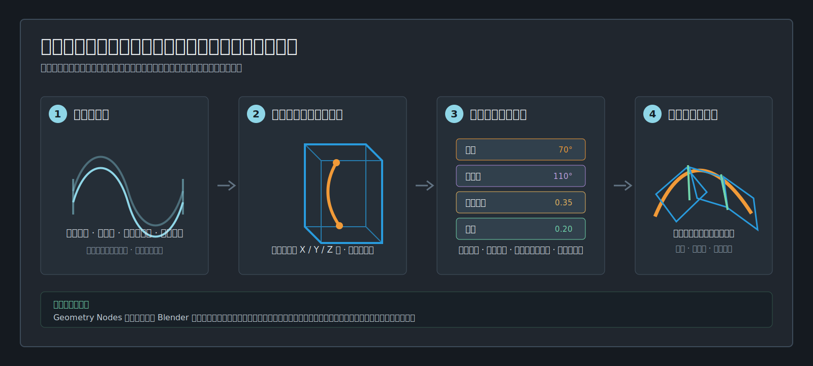
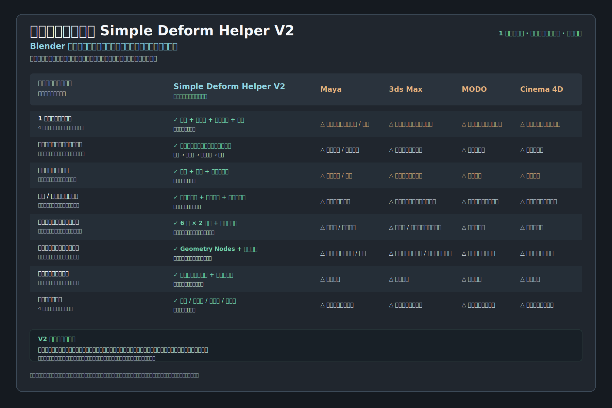

<div align="center">

# 世界をリードする Simple Deform Helper V2

**Blender の制作向け変形ワークフロー。見えるケージで曲げ、ねじり、テーパー、伸縮を組み合わせます。**

[](https://github.com/AIGODLIKE/simple_deform_helper/releases/download/v2.0.0/simple_deform_helper-2.0.0.zip)
[](https://www.blender.org/download/lts/4-2/)

[English](README.md) · [简体中文](README.zh_HANS.md) · [한국어](README.ko_KR.md) · [リリース](https://github.com/AIGODLIKE/simple_deform_helper/releases) · [バグ報告](https://github.com/AIGODLIKE/simple_deform_helper/issues/new?template=bug_report.yml)

</div>

V2 は、変形が起きる**場所**をケージで、変わる**内容**をビューポートハンドルで、評価される**順序**をレイヤーリストで確認できるようにします。



## V2 の強み

| 制作上の課題 | V2 の答え |
|---|---|
| 複合変形 | 1 つのケージに Bend、Twist、Taper、Stretch を追加し、順序変更・一時バイパス・ライブ確認。 |
| 長い連続形状 | **チェーンケージ**で 2-8 分割、間隔、自動再接続、共有継ぎ目スケール同期。 |
| 非対称な端部 | 上下端の長さ、X/Z スケール、X/Z オフセットを個別に編集。中心対称を強制しません。 |
| 曲げ方向の選択 | 六面それぞれに横・縦 2 種類の **Bend Trend**。軸変更後は **Align & Fit**。 |
| 引き継ぎ | Geometry Nodes のステージをモディファイアスタックに残し、確認・アニメーション可能。 |



比較図は機能の集中度と一般的な制作フローを示すもので、他のソフトウェアが個別の結果を再現できないという主張ではありません。

## インストール

1. [Release の `simple_deform_helper-2.0.0.zip`](https://github.com/AIGODLIKE/simple_deform_helper/releases/download/v2.0.0/simple_deform_helper-2.0.0.zip) をダウンロードします。Source code ZIP は使用しないでください。
2. Blender の **Edit > Preferences > Get Extensions** を開きます。
3. 右上メニューの **Install from Disk** から ZIP を選びます。
4. 3D View で `N` を押し、**Simple Deformer V2** タブを開きます。

## 60 秒で最初の曲げ

1. Object Mode で Mesh、Curve、Surface、または Text を選択します。
2. **Add Cage Deform** を押します。
3. **Deformation Layers** の Bend で角度を設定します。
4. **Cage Controls** で Auto または `X+ / X- / Y+ / Y- / Z+ / Z-` を選び、**Align & Fit** を押します。
5. **Bend Trend** の矢印をクリックして向きを選び、オレンジのハンドルをドラッグします。`Shift` は精密、`Ctrl` はスナップです。
6. 終了時は **Return to Object** を押します。

低ポリゴンで曲げが粗い場合は、変形軸方向の分割数を増やしてください。

## 1 ケージで複合変形

レイヤーは上から下へ評価されます。例：

```text
Object input -> Bend -> Twist -> Taper -> Stretch -> Independent Ends -> output
```

**Add Deformation** でレイヤーを追加し、上下矢印で順番を変更します。目のアイコンは一時バイパス、`X` は削除、**Expand All** は全レイヤーを展開します。順序を変えてもセットアップを作り直す必要はありません。

## チェーンケージ

### 新しいチェーン

1. **Add Chained Cages** を押します。
2. 数（`2-8`）、**Chained** / **Independent**、**Gap**、軸を設定します。
3. 連続形状では **Auto Reconnect** と **Sync Shared End Scale** を有効にします。
4. **Show Other Cages** で非アクティブなケージを表示・選択できます。
5. 軸を変更した後は **Align & Fit Chain** を使います。

### 既存ケージの分割と一括編集

**Bottom** Origin の単一ケージを選び、**Subdivide to Chained Cages** を実行すると、外側の範囲を保ったチェーンになります。Bend/Twist の角度は分割へ配分され、間隔は範囲内に制限されます。**Batch Edit** では全体、アクティブまで、アクティブ以降を選び、端部スケール、オフセット、間隔、変形値、ステージ表示をライブプレビューできます。キャンセルすると元に戻ります。

接続ケージの内部境界は重ならず、必要なら間隔を残せます。共有継ぎ目だけが同期され、外側の端部は独立します。

## コントローラー

| 色 / 形状 | 操作 |
|---|---|
| オレンジの矢印 | Bend 角度。`Shift` 精密、`Ctrl` スナップ。 |
| 大きな紫の円弧 | Twist 角度。中心の周りをドラッグ。 |
| アンバー / 緑 | Taper / Stretch の係数。 |
| 黄色上端 / アンバー下端 | 一方の境界だけを移動。オブジェクト境界で停止可能。 |
| シアン上端 / 緑下端 | 一方の断面だけを編集。`Alt` でローカル X にスライド。 |
| 赤 / 緑の矢印 | Bend Trend。`Ctrl` で選択肢を開いたままにします。 |
| RGB の菱形 / リング | 正 / 負の軸切り替え。 |

ハンドルにカーソルを置くと機能名が表示されます。管理用 Empty は **Simple Deform Controls** コレクションにまとめられ、必要な時だけ表示されます。

## 対応範囲

- Blender 4.2 LTS 以降。
- ケージ：Mesh、Curve、Surface、Text。
- Lattice：**Add Simple Deform (Legacy)** のみ。ケージ非対応の案内を表示します。
- ケージは Geometry Nodes、Legacy は Blender の標準 Simple Deform を使用します。
- UI：English、简体中文、日本語、한국어。
- ケージ値、レイヤー、変換、表示状態、Legacy プロパティをアニメーション可能です。

## トラブルシューティング

| 症状 | 確認 |
|---|---|
| タブがない | 拡張を有効にし、3D View で `N` を押します。更新後は Blender を再起動します。 |
| 変形しない | Object Mode で対応オブジェクトを選択し、ステージを **Align & Fit** します。 |
| チェーンがずれる | **Auto Reconnect** と **Reconnect Chain**、Gap、継ぎ目スケールを確認します。 |
| 曲げが粗い | 変形軸方向のジオメトリ分割を増やします。 |
| Lattice にケージを追加できない | 意図した制限です。Legacy を使用してください。 |

## フィードバックとライセンス

[Issue template](https://github.com/AIGODLIKE/simple_deform_helper/issues/new?template=bug_report.yml) に Blender/拡張バージョン、OS、GPU、再現手順、コンソールログ、最小 `.blend` を添付してください。Simple Deform Helper V2 は [`blender_manifest.toml`](blender_manifest.toml) の宣言どおり **GPL-3.0-or-later** です。
