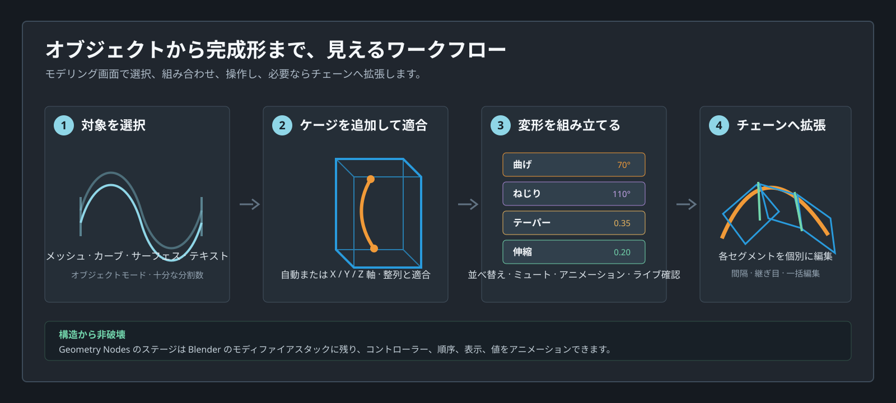
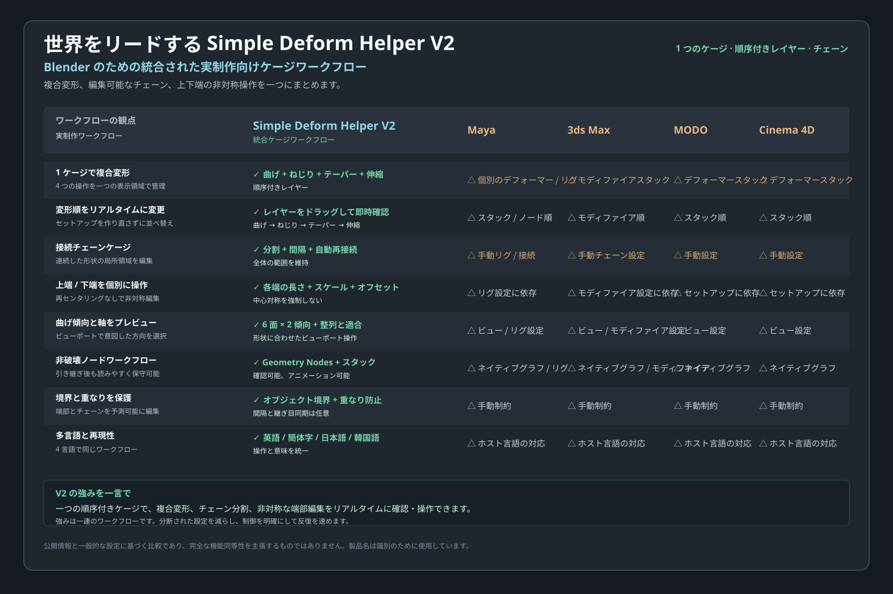

<div align="center">

# シンプル変形器 V2（Simple Deform Helper V2）

### 変形もアニメーションも、かんたんに

**最初のケージは約 0.04 秒で作成。キー挿入 1 回で数十本のアニメーションチャンネルを記録。**

[](https://github.com/AIGODLIKE/simple_deform_helper/releases)
[](https://www.blender.org/download/)
[](https://github.com/AIGODLIKE/simple_deform_helper/actions/workflows/validate.yml)

[English](README.md) · [简体中文](README.zh_HANS.md) · [한국어](README.ko_KR.md) · [リリース](https://github.com/AIGODLIKE/simple_deform_helper/releases) · [バグ報告](https://github.com/AIGODLIKE/simple_deform_helper/issues/new?template=bug_report.yml)

</div>

<!-- ここに 3〜5 秒のループデモ動画を置くのがおすすめです（曲げハンドルのドラッグ / キー 2 つで再生 / チェーンのしっぽが揺れる様子）。冒頭の動画はどんな文章よりも説得力があります。 -->

ネイティブの Simple Deform（シンプル変形）モディファイアーを使ったことが
あれば、あの手間はご存知のはずです。軸は当てずっぽうで切り替え、変形の
原点はエンプティを作って手で動かし、アニメーションはモディファイアー
パネルでプロパティを 1 本ずつキー入力。この拡張機能は、そのすべてを目に
見える変形ケージにまとめました。ケージを置いた場所で変形が起き、
パラメーターごとに専用ハンドルがあり、ドラッグした瞬間に効きます。
アニメーションを付けるときは、ボタン 1 つで現在フレームの状態を丸ごと
記録します。



「しっぽを揺らす」を例にすると：

| | これまでのやり方 | この拡張機能 |
|---|---|---|
| 準備 | アーマチュアを組んでウェイトペイント、またはラティスとモディファイアーを設定 | しっぽを選択して**標準型チェーンケージを追加**をクリック |
| ポーズ付け | ボーンを 1 本ずつ回転 | 曲げハンドルをドラッグ |
| キー入力 | プロパティを 1 つずつキー挿入 | **キーを挿入**を 1 クリック |
| ファイルの受け渡し | 相手にも同じリグやアドオン環境が必要 | ケージは通常のジオメトリーノードモディファイアー。拡張機能なしでも再生できます |

## 時間が節約できる理由

- すべての変形パラメーターにビューポートハンドルがあります。曲げ、
  ねじり、テーパー、伸縮、シアー、FFD ポイント、カーブガイドそれぞれに
  色分けされた専用ハンドルが用意され、ホバーすると名前が表示されます。
  値を変えるためにモディファイアーパネルを探し回る必要はありません。
- **キーを挿入**は、アクティブなケージの状態を現在フレームへ一括記録
  します。レイヤー強度、端部形状、FFD ポイントのオフセットと影響度、
  カーブガイド、ケージサイズ、コントローラーのトランスフォームまで、
  数十本のチャンネルをボタン 1 つで。**キーを削除**はそのチャンネルだけ
  を消し、アクション内のほかのキーには触れません。
- 決定稿になったら**メッシュアニメーションをベイク**。変形全体が絶対
  シェイプキー付きの独立メッシュになります。エクスポートにもレンダー
  ファームにも、この拡張機能は不要です。
- ケージは通常のジオメトリーノードモディファイアーとしてスタックに表示
  され、順序も自由に入れ替えられます。拡張機能を無効にしてもファイルは
  そのまま評価されます。
- ハンドルのドラッグ 1 回がアンドゥ 1 ステップ。動かさずにクリックした
  だけなら記録されません。アニメーション付きファイルは開いてすぐ再生
  できます。
- 最初のケージは約 0.04 秒で完成。8 セグメントのチェーンもドラッグ中の
  再接続が約 50 ミリ秒で、操作が引っかかりません。



比較図が示すのは、これらのコントロールが 1 つの Blender ワークフローに
どれだけ集約されているかであって、他のソフトウェアで個々の結果を再現
できないという意味ではありません。製品名は比較対象の識別のためだけに
使用しています。

## 60 秒で最初の変形

1. **オブジェクトモード**でメッシュ、カーブ、サーフェス、テキストの
   いずれかを選択します。
2. `N` キーで **シンプル変形器 V2** タブを開き、**標準型ケージを追加**を
   クリックします。
3. **変形レイヤー**で**曲げ**を選んだまま、ビューポートのオレンジ色の
   曲げハンドルをドラッグします。`Shift` で微調整、`Ctrl` でスナップ。
4. 方向が違うときは、**自動**または `X+ / X- / Y+ / Y- / Z+ / Z-` 軸を
   指定して**整列してフィット**。**曲げ傾向**を有効にして、任意の面の
   赤／緑の矢印をクリックしても曲げる方向を選べます。
5. 調整が終わったら**オブジェクトに戻る**をクリックします。

曲げがカクカクして見える場合は、ケージステージより前に変形軸方向の
ジオメトリを追加してください。パネルはトポロジー不足を警告しますが、
勝手に細分化を追加することはありません。

## さらに 30 秒で動かす

1. 開始フレームでポーズを決めて、**キーを挿入**をクリック。
2. タイムラインを数フレーム進めて別のポーズを付け、もう一度クリック。
3. 再生。ケージパラメーターは通常のアニメーションと同じように補間される
   ので、グラフエディターでのイージングもループも自由です。

標準型・チェーン・シアー・FFD・カーブの各ケージも、従来の Simple Deform
モディファイアーも、キー入力はすべて同じボタンです。

ショットが確定したら**メッシュアニメーションをベイク**でフレーム範囲・
サンプリング間隔・名前を指定すると、きれいなシェイプキーメッシュが
得られます。ベイク後に元オブジェクトを自動で隠すこともできます。

## ショットに合わせてケージを選ぶ

| 作りたい動き | 使うもの | 得られるもの |
|---|---|---|
| 局所的な曲げ／ねじり／テーパー／伸縮、またはその重ね掛け | **標準型ケージを追加** | 並べ替え可能な**曲げ / ねじり / テーパー / 伸縮**レイヤーを持つケージ 1 つ。 |
| しっぽ、触手、ケーブル、アンテナ、背骨 | **標準型チェーンケージを追加** | 2〜8 個の連結セグメント。下流へ自動再接続し、継ぎ目も同期。 |
| 蛇、つる、旗など、描いたパスに沿った動き | **カーブケージを追加** | 編集可能なベジェガイド。**直線 / ウェーブ / 正弦波 / らせん**のライブプリセットと、アニメーション可能な断面。 |
| 柔らかいつぶれ、ふくらみ、へこみ、カートゥーン的なスミア | **FFD型ケージを追加** | `2x2x2`〜`6x6x6` のラティスケージ。ポイントごとの影響度、対称編集、折れ防止付き。 |
| 斜体のような平面スライド | **シアー型ケージを追加** | 平面内を自由に滑らせる専用のシアン色端面ハンドル。 |
| すでに Simple Deform を使っている既存ファイル | **Simple Deform を追加（従来）** | ネイティブモディファイアーに、ステージ対応ギズモ・リミット・原点コントロール・同じキー／ベイクボタンをプラス。 |
| ラティスオブジェクト | **Simple Deform を追加（従来）** | ネイティブモディファイアーのみ対応。ラティスへのケージ変形は意図的に非対応。 |

シアーと FFD にはチェーン用ボタンもあります（**シアー型チェーンケージを
追加**、**FFD型チェーンケージを追加**）。カーブケージが単一ステージなのは
意図的な設計です。

複数オブジェクトを選択した状態でケージ追加をクリックすると、ライブ結合を
作ってまとめて変形します。`Ctrl` クリックなら選択オブジェクトそれぞれに
独立したケージを作ります。

## アニメーションツールボックス

| ツール | 内容 |
|---|---|
| **キーを挿入** | アクティブステージの変形状態を現在フレームへ丸ごと記録：各レイヤーの強度と方向、シアー係数、FFD 各ポイントのオフセットと影響度、カーブガイドポイントと全体半径／全体ツイストと範囲、端部スケール／オフセット、ケージサイズ、ステージ表示状態、コントローラーの位置／回転。 |
| **キーを削除** | 上記チャンネルの現在フレームのキーだけを削除。アクション内のほかのキーはそのまま。 |
| **メッシュアニメーションをベイク** | 指定フレーム範囲（開始・終了・ステップ）で評価結果をサンプリングし、絶対シェイプキー付きの独立メッシュを生成。ベイク後に元オブジェクトを隠すオプション付き。 |
| **ステージ表示のアニメーション** | `stage_enabled` はアニメーション可能なチャンネル。ケージをショットの途中から効かせることもできます。 |
| **アンドゥ境界** | ハンドルドラッグ、レイヤー編集、従来型ギズモ操作はそれぞれ 1 ステップのアンドゥ。ドラッグをキャンセルすれば元の状態に戻ります。 |
| **ファイル読み込み時の復元** | アニメーション付きケージのファイルを開くと自動で同期を復元。空のシーンで起動した後に開いても同じです。 |

キーを挿入が書き込むのはすべて通常の F カーブで、**Simple Deform Helper**
チャンネルグループにまとまります。グラフエディター、ドープシート、NLA で
普通に編集でき、ドライバーを載せることもできます。

## 各ケージの使い方

### 標準型ケージと変形レイヤー

標準型ケージは有効なレイヤーを上から下へ評価するため、順序が結果を
変えます：

```text
オブジェクト入力 -> 曲げ -> ねじり -> テーパー -> 伸縮 -> 独立端部形状 -> 出力
```

- **変形を追加**でレイヤーを追加。上下矢印で並べ替え、目のアイコンで値を
  保持したまま一時ミュート、`X` で削除、**すべて展開**で複数レイヤーを
  並べて調整できます。
- レイヤーを選択すると、対応するハンドルがビューポートに表示されます。
- よく使う順序：曲げの後にねじりを掛けるとねじれたパイプに、テーパーの
  後に曲げると角やノズルに、伸縮の後に曲げると弾性のある動きになります。
  案を比較するときはレイヤーのミュートが最速です。
- **独立端部**：上端と下端の長さ、X/Z スケール、X/Z オフセットはすべて
  独立で、中心対称を強制しません。**独立端部をリセット**でフィット時の
  断面に戻ります。
- **空間モード**はケージ外の挙動を決めます：**制限**（ケージ端から継続）、
  **ケージ内**（内側のみ）、**無制限**（全域へ継続）、**チェーン**（上流を
  固定したまま継続）。
- **原点**は変形の起点：**下**、**中央**、**対称**、**上**。
- 普段はコンパクトパネルで十分です。パネルヘッダーのレンチアイコンで
  **プロフェッショナルモード**を有効にすると、変形軸・独立端部・数値
  コントロールが現れます。

### チェーンケージ

- 一度に 2〜8 セグメントを作成。**チェーン**（連続）と**独立**（各自の
  ボックス内のみ）を選べ、間隔も設定できます。
- **自動再接続**は上流の変更を下流へ伝えます。**共有端部スケールを同期**
  は継ぎ目の両側を一緒にスケールして裂け目を防ぎ、チェーン両端は独立の
  ままです。
- **チェーンケージへ細分化**は、調整済みの標準型ケージを全体範囲を変えず
  にチェーンへ分割します。曲げ／ねじりの値は各セグメントへ配分されます。
- **一括編集**はライブプレビュー付きダイアログで、チェーン全体（または
  先頭〜アクティブ、アクティブ〜末尾）をまとめて調整します：端部スケール、
  端部オフセット、間隔、変形パラメーター、ステージ表示。キャンセルすれば
  完全に元へ戻ります。
- モディファイアースタックを並べ替えてもセグメントの順序は崩れません。
  一度に 4 ステージ以上を作るとビューポート性能の注意が表示されますが、
  作成は妨げられません。

### カーブケージ

- ガイドは本物のベジェカーブで、ビューポートで直接編集します。ポイントの
  クリック選択・ボックス選択に対応し、移動／回転／スケール／半径／
  ツイストはプロポーショナル編集が効きます。**カーブ全域減衰**を有効に
  すると、1 回の編集をガイド全体へ広げられます。
- **ライブプリセット**（直線、ウェーブ、正弦波、らせん）は振幅・周期・
  位相・ポイント数のドラッグ中に即時更新され、結果はいつでも編集できる
  カーブのままです。
- **断面**はガイド上の任意位置にアニメーション可能な半径／ツイストの
  ステーションを追加します。**断面を自動等間隔化**で等間隔を維持。
  全体半径／全体ツイストは加算的に効き、ポイントごとの値を上書き
  しません。
- ガイドの変形は、バインド時に記録した静止形状に対して計算されます。
  現在の形状を新しい静止状態にしたいときは**カーブを再バインド**を
  クリックします。

### FFD ケージ

- 各軸の解像度は `2〜6` ポイント（最大 `6x6x6`）。いつでも変更でき、
  調整済みのオフセットは失われません。
- ポイント／ライン／フェースの 3 つの選択モード、ボックス選択、全選択／
  解除／反転、グループドラッグに対応。**中空 FFD** は内部ポイントを隠して
  除外します。
- **対称編集**はケージローカルの U/V/W 中心面でミラーします。
- ポイントごとの**影響度**（0〜1）は各コントロールポイントの効き具合を
  決めます。影響度自体にもキーを打てるので、効果範囲を時間変化させられ
  ます。
- **FFD 安全保護**の**折れ防止**モードは、編集を最後の折り返しのない
  ラティス状態に制限します。素早くポーズを付けてもメッシュが裏返り
  ません。
- **ネイティブラティス編集**はプロキシ上で Blender 標準のラティス編集
  モードを開きます。編集と選択はケージ状態へ同期されます。

### 複数オブジェクトの結合変形

- **選択物を変形用に結合**（または**変形用にコレクションをマージ**）は、
  メッシュ・カーブ・サーフェス・テキスト・メタボール・ヘアーカーブ・
  ポイントクラウドをライブ結合します。元オブジェクトはリンクされたまま、
  結合結果を更新し続けます。
- 結合結果の任意の部分をダブルクリックすると、その元オブジェクトを編集
  できます。編集中は青いプレビューが、モディファイアースタック全体を
  通した最終状態を表示します。
- **最終状態の元にケージを追加**は、結合体の現在のスタックの後に、
  ソースマスク付きのケージをフィットさせます。キャラクターの一部だけを
  変形し、残りには影響しません。
- **結合オブジェクトに戻る**で編集を終了。リンク解除で結合体を削除して
  元オブジェクトを復元します。

## ビューポートハンドル早見表

| ハンドル | 意味 | 操作 |
|---|---|---|
| オレンジの二重矢印 | 曲げ角度 | ドラッグ。`Shift` 微調整、`Ctrl` スナップ。 |
| 大きなオレンジのリング | 曲げ方向 | **ねじりを表示**を有効にしてドラッグ。 |
| 大きな紫の円弧 | ねじり角度 | 中心の周りをドラッグ。継ぎ目をまたいでも角度は連続。 |
| 琥珀色のハンドル | テーパー係数 | ドラッグ。`Shift` 微調整、`Ctrl` スナップ。 |
| 緑のハンドル | 伸縮係数 | ドラッグ。`Shift` 微調整、`Ctrl` スナップ。 |
| 黄色（上）／琥珀色（下） | 片側の境界だけ移動 | ケージ軸に沿ってドラッグ。**オブジェクト境界内に制限**に従います。 |
| シアンの冠形／緑のトレー形 | 片側端部の形状のみ変更 | ドラッグでスケール。`Alt` 画面 X、`Shift` 画面 Y、`Alt+Shift` 自由移動、`Ctrl` スナップ。 |
| シアンの十字プレーン | シアーの端面スライド | 端面内でドラッグ。`Alt` はケージ X、`Shift` はケージ Z にロック、`Ctrl` スナップ。 |
| ピンク／シアンのラティスポイント | FFD コントロールポイント | 選択グループをまとめてドラッグ。ボックス選択、全選択／解除／反転対応。 |
| 白いカーブポイントとハンドル | カーブガイド | クリック、ボックス選択、ドラッグ。プロポーショナル編集対応。 |
| 赤／緑の矢印 | 各面の曲げ傾向 | クリックで選択。`Ctrl` を押している間はすべて表示。 |
| RGB のダイヤ／リング | X・Y・Z 軸の正／負 | ダイヤが正方向、リングが負方向。 |

どのハンドルもホバーで名前が表示されます。ヘルパーオブジェクトは
**Simple Deform Controls** コレクションにまとまり、必要なときだけ現れ
ます。ケージワイヤーをオブジェクト越しに表示するかどうかは**前面に表示**
で切り替えます。

## インストール

1. [リリースページ](https://github.com/AIGODLIKE/simple_deform_helper/releases)
   から `simple_deform_helper-2.7.48.zip` をダウンロードします。GitHub が
   自動生成する Source code ZIP は使わないでください。
2. Blender で **編集 > プリファレンス > エクステンションを入手** を開き、
   **ディスクからインストール**で ZIP を選択します。
3. 自動で有効にならない場合は **Simple Deform Helper** を有効化します。
4. 3D ビューポートで `N` を押し、**シンプル変形器 V2** タブを開きます。

インストールは 1 つだけにしてください。別のリポジトリに同じ拡張 ID が
残っていると、このバージョンは有効化を拒否して重複先を表示します。古い
コピーを削除し、Blender を再起動してから有効化してください。Blender
Extensions の公式リストで公開された後は、Blender 内蔵の**更新**を優先して
ください。重要な制作ファイルを更新する前には、バージョン番号付きの
`.blend` コピーの保存をおすすめします。

## 互換性

| 項目 | 対応状況 |
|---|---|
| Blender | **5.0.0 以降**。CI は最小対応版と現行対応版を検証。 |
| ケージ対象 | メッシュ、カーブ、サーフェス、テキスト。 |
| 結合ソース | メッシュ、カーブ、サーフェス、テキスト、メタボール、ヘアーカーブ、ポイントクラウド。 |
| ラティス | 従来の Simple Deform のみ。明示的な案内を表示。 |
| エンジン | ケージはジオメトリーノード、従来モードはネイティブ Simple Deform。 |
| 言語 | 英語、簡体字中国語、日本語、韓国語。 |
| アニメーション | 変形レイヤー値、FFD ポイントと影響度、カーブガイドと断面、端部形状、ケージサイズ、トランスフォーム、ステージ表示状態、従来モディファイアーのプロパティ。 |
| 保存結果 | 生成されたノードステージは拡張機能なしでも評価され続けます。専用 UI とコントローラー管理には拡張機能が必要です。 |

## よくある質問

| 症状 | 確認すること |
|---|---|
| 「シンプル変形器 V2」タブがない | 拡張機能が有効か確認し、3D ビューポートで `N` を押す。旧バージョンを置き換えた後は Blender を一度再起動。 |
| ケージを追加しても効果がない | オブジェクトモードで対応オブジェクトを選択しているか確認。複製でノードステージが失われた場合は、古いステージを削除して追加し直す。 |
| 再生してもメッシュが動かない | ケージパラメーターにキーが入っているか確認（最低 2 フレームで**キーを挿入**）。アニメーション付きファイルは開いたときに自動で再同期されます。 |
| 曲げがカクカクする | ケージステージより前に変形軸方向のジオメトリを追加。 |
| ケージがオブジェクトと合わない | ステージを選択して軸を設定し、**整列してフィット**または**チェーンを整列してフィット**をクリック。 |
| チェーンに継ぎ目が出る | **自動再接続**を有効にし、**チェーンを再接続**をクリック。**手前の間隔**と継ぎ目のスケールを確認。 |
| ハンドルが見つからない | 対象またはケージと該当レイヤーを選択し、曲げ傾向／ねじりを表示／端部／長さの各オプションを有効化。 |
| ラティスにケージを追加できない | 意図的な制限です。**Simple Deform を追加（従来）**を使用してください。 |

## データとアンインストール

ケージステージを削除すると、それが管理するジオメトリーノード
モディファイアーとヘルパーオブジェクトも削除されます。拡張機能を
アンインストールしても、`.blend` 内に生成済みのノードグループは自動では
消えません。先に**変形スタックを削除**を実行してから、別名で保存して
ください。

## フィードバックと貢献

[バグ報告フォーム](https://github.com/AIGODLIKE/simple_deform_helper/issues/new?template=bug_report.yml)
に、拡張機能と Blender のバージョン、OS／GPU／入力デバイス、正確な再現
手順とモディファイアー順序、コンソール出力、個人情報を除いた最小の
`.blend` ファイルまたは短い動画を添えてください。

Pull Request は Blender 5.0+ との互換を保ち、サードパーティのランタイム
依存を追加せず、ユーザー向けテキストの 4 言語カタログを揃えて更新し、
リポジトリの検証ワークフローを通過する必要があります。

## ライセンス

シンプル変形器 V2 は [`blender_manifest.toml`](blender_manifest.toml) の
宣言どおり **GPL-3.0-or-later** で配布されます。Maya、3ds Max、MODO、
Cinema 4D、Blender および各商標はそれぞれの所有者に帰属し、識別と
ワークフロー比較のためにのみ言及しています。
