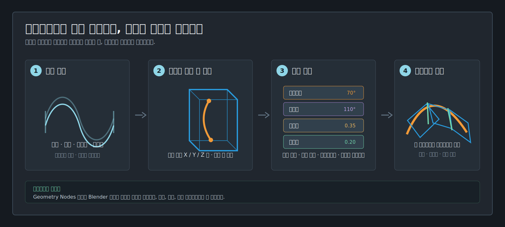
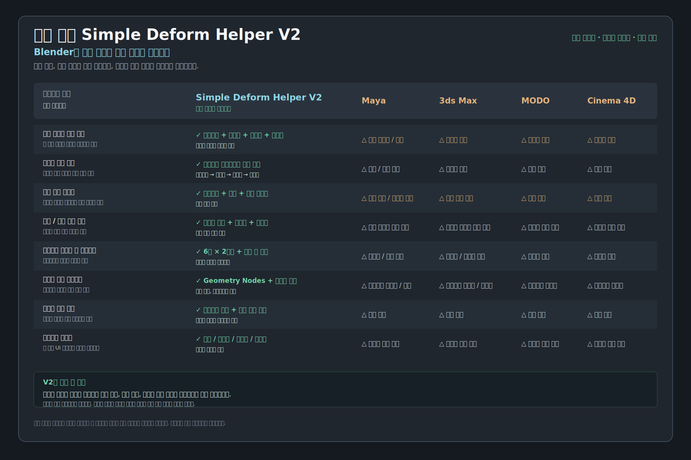

<div align="center">

# 세계 선도 Simple Deform Helper V2

**Blender 제작을 위한 변형 워크플로: 보이는 케이지에서 구부리기, 비틀기, 테이퍼, 늘리기를 조합합니다.**

[](https://github.com/AIGODLIKE/simple_deform_helper/releases/download/v2.0.0/simple_deform_helper-2.0.0.zip)
[](https://www.blender.org/download/lts/4-2/)

[English](README.md) · [简体中文](README.zh_HANS.md) · [日本語](README.ja_JP.md) · [릴리스](https://github.com/AIGODLIKE/simple_deform_helper/releases) · [버그 신고](https://github.com/AIGODLIKE/simple_deform_helper/issues/new?template=bug_report.yml)

</div>

V2는 케이지로 변형이 발생하는 **위치**, 뷰포트 핸들로 바뀌는 **내용**, 레이어 목록으로 평가되는 **순서**를 한눈에 보여 줍니다.



## V2가 강한 이유

| 제작 문제 | V2의 해답 |
|---|---|
| 복합 변형 | 하나의 케이지에서 구부리기, 비틀기, 테이퍼, 늘리기를 순서대로 조합하고 일시 우회하며 실시간 확인합니다. |
| 긴 연속 형태 | **체인 케이지**가 2-8개 세그먼트, 간격, 자동 재연결, 공유 접합부 스케일 동기화를 제공합니다. |
| 비대칭 끝단 | 상단과 하단의 길이, X/Z 스케일, X/Z 오프셋을 독립적으로 편집합니다. 중심 대칭을 강제하지 않습니다. |
| 방향 선택 | **구부리기 경향**이 여섯 면마다 가로/세로 방향을 제공하고 축 변경 후 **정렬 및 맞춤**을 실행합니다. |
| 인수인계 | Geometry Nodes 단계가 Blender 수정자 스택에 남아 확인과 애니메이션이 가능합니다. |



비교 이미지는 기능을 한 워크플로에 집중하는 방식을 보여 주며, 다른 소프트웨어가 개별 결과를 만들 수 없다는 뜻은 아닙니다.

## 설치

1. [Release의 `simple_deform_helper-2.0.0.zip`](https://github.com/AIGODLIKE/simple_deform_helper/releases/download/v2.0.0/simple_deform_helper-2.0.0.zip)을 받습니다. GitHub의 Source code ZIP은 사용하지 마세요.
2. Blender에서 **Edit > Preferences > Get Extensions**를 엽니다.
3. 우측 상단 메뉴에서 **Install from Disk**를 선택하고 ZIP을 지정합니다.
4. 3D View에서 `N`을 누르고 **Simple Deformer V2** 탭을 엽니다.

## 60초 첫 변형

1. Object Mode에서 Mesh, Curve, Surface 또는 Text를 선택합니다.
2. **Add Cage Deform**을 클릭합니다.
3. **Deformation Layers**에서 Bend를 선택하고 각도를 설정합니다.
4. **Cage Controls**에서 Auto 또는 `X+ / X- / Y+ / Y- / Z+ / Z-`를 고른 뒤 **Align & Fit**을 누릅니다.
5. **Bend Trend** 화살표로 방향을 고르고 주황색 핸들을 드래그합니다. `Shift`는 정밀 조정, `Ctrl`은 스냅입니다.
6. 끝나면 **Return to Object**를 누릅니다.

변형이 각지면 변형 축 방향의 지오메트리 세그먼트를 늘리세요.

## 한 케이지에서 복합 변형

레이어는 위에서 아래로 실행됩니다.

```text
Object input -> Bend -> Twist -> Taper -> Stretch -> Independent Ends -> output
```

**Add Deformation**으로 레이어를 추가하고 위/아래 화살표로 순서를 바꿉니다. 눈 아이콘은 일시 우회, `X`는 삭제, **Expand All**은 모든 레이어를 펼칩니다. 순서를 바꿔도 셋업을 다시 만들 필요가 없습니다.

## 체인 케이지

### 새 체인 만들기

1. **Add Chained Cages**를 클릭합니다.
2. 수량(`2-8`), **Chained** / **Independent**, **Gap**, 축을 설정합니다.
3. 연속 파이프 형태에는 **Auto Reconnect**와 **Sync Shared End Scale**을 켭니다.
4. **Show Other Cages**로 비활성 케이지를 표시하고 직접 선택합니다.
5. 축을 바꾼 뒤 **Align & Fit Chain**을 사용합니다.

### 기존 케이지 분할과 일괄 편집

Origin이 **Bottom**인 단일 케이지를 선택하고 **Subdivide to Chained Cages**를 실행하면 외부 범위를 유지한 체인이 만들어집니다. Bend/Twist 각도는 세그먼트에 분배되고 간격은 전체 범위 안에서 제한됩니다. **Batch Edit**에서는 전체 체인, 활성까지, 활성 이후를 선택해 끝단 스케일/오프셋, 간격, 변형값, 스테이지 표시를 실시간 미리보기할 수 있으며 취소하면 원상복구됩니다.

체인 내부 경계는 겹치지 않고 의도적인 간격을 유지할 수 있습니다. 공유 접합부만 동기화되며 양쪽 외부 끝단은 독립적입니다.

## 컨트롤러 빠른 참조

| 색상 / 모양 | 동작 |
|---|---|
| 주황색 이중 화살표 | Bend 각도. `Shift` 정밀, `Ctrl` 스냅. |
| 큰 보라색 호 | Twist 각도. 중심을 기준으로 드래그. |
| 호박색 / 녹색 | Taper / Stretch 계수. |
| 노란 상단 / 호박색 하단 | 한쪽 경계만 이동. 오브젝트 경계 제한 가능. |
| 청록 상단 / 녹색 하단 | 한쪽 단면만 편집. `Alt`로 로컬 X 슬라이드. |
| 빨강 / 초록 화살표 | Bend Trend. `Ctrl`로 선택기를 열린 상태로 유지. |
| RGB 다이아몬드 / 링 | 양 / 음 축 전환. |

핸들 위에 마우스를 올리면 기능명이 표시됩니다. 관리용 Empty는 **Simple Deform Controls** 컬렉션에 모이며 필요할 때만 표시됩니다.

## 호환성과 제한

- Blender 4.2 LTS 이상.
- 케이지 대상: Mesh, Curve, Surface, Text.
- Lattice: **Add Simple Deform (Legacy)**만 제공하며 케이지 미지원 안내를 표시합니다.
- 케이지는 Geometry Nodes, Legacy는 Blender 기본 Simple Deform을 사용합니다.
- UI 언어: English, 简体中文, 日本語, 한국어.
- 케이지 값, 레이어, 변환, 표시 상태, Legacy 속성을 애니메이션할 수 있습니다.

## 문제 해결

| 증상 | 확인 |
|---|---|
| 탭이 보이지 않음 | 확장을 활성화하고 3D View에서 `N`을 누릅니다. 업데이트 후 Blender를 재시작하세요. |
| 변형되지 않음 | Object Mode에서 지원 대상을 선택하고 **Align & Fit**을 실행합니다. |
| 체인이 어긋남 | **Auto Reconnect**, **Reconnect Chain**, Gap, 접합부 스케일을 확인합니다. |
| 구부리기가 거침 | 변형 축 방향의 지오메트리 세그먼트를 늘립니다. |
| Lattice에 케이지를 추가할 수 없음 | 의도된 제한입니다. Legacy를 사용하세요. |

## 피드백과 라이선스

[Issue template](https://github.com/AIGODLIKE/simple_deform_helper/issues/new?template=bug_report.yml)에 Blender/확장 버전, OS, GPU, 재현 단계, 콘솔 로그, 최소 `.blend` 파일을 첨부해 주세요. Simple Deform Helper V2는 [`blender_manifest.toml`](blender_manifest.toml)에 선언된 **GPL-3.0-or-later**입니다.
