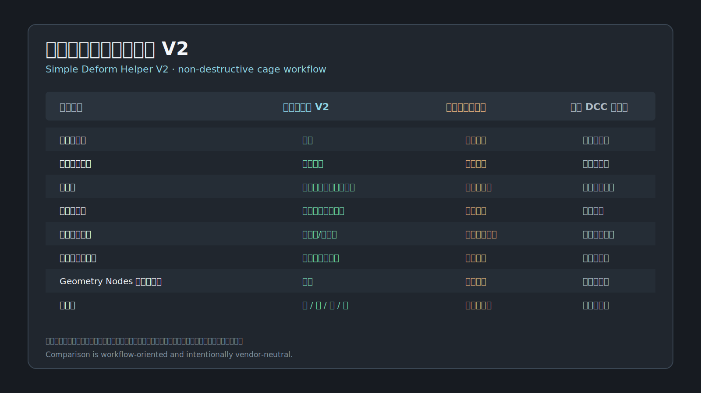

# 심플 디포머 헬퍼 V2

[English](README.md) · [简体中文](README.zh_HANS.md) · [日本語](README.ja_JP.md)

**Simple Deform Helper V2**는 Blender용 비파괴 케이지 변형 워크플로입니다. Bend, Twist, Taper, Stretch를 하나의 케이지에서 조합하고, 변형 레이어 순서, 체인 케이지, 상단과 하단의 독립 편집을 실시간으로 관리할 수 있습니다.

## 주요 기능

- 하나의 케이지에서 Bend / Twist / Taper / Stretch를 조합하고 레이어 순서를 드래그로 변경.
- 세그먼트, 간격, 자동 재연결, 공유 접합부 스케일 동기화를 지원하는 체인 케이지.
- 상단과 하단의 길이, 스케일, 오프셋을 독립적으로 편집하고 오브젝트 경계 안으로 제한.
- 6면 Bend Trend, 형태별 컨트롤러, 호버 툴팁.
- Geometry Nodes 기반 비파괴 처리와 Blender 수정자 스택의 공존.
- 영어, 중국어 간체, 일본어, 한국어 UI 번역.

## 빠른 시작

1. Object Mode에서 Mesh, Curve, Surface 또는 Text를 선택합니다.
2. 3D 뷰포트 사이드바에서 **Simple Deformer V2**를 엽니다.
3. **Add Cage Deform**을 클릭하고 변형 레이어를 추가한 뒤 순서를 조정합니다.
4. 단일 케이지에는 **Align & Fit**, 체인에는 **Align & Fit Chain**을 사용합니다.

## 설치

GitHub Release에서 `simple_deform_helper-2.0.0.zip`을 다운로드한 뒤 **Edit > Preferences > Get Extensions > Install from Disk**로 설치합니다.

비교 이미지는 주요 DCC의 일반적인 워크플로를 요약한 것이며 완전한 기능 동등성을 주장하지 않습니다.
