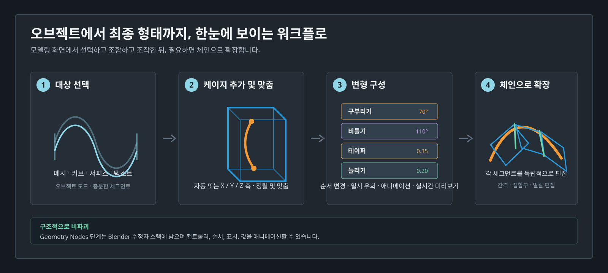
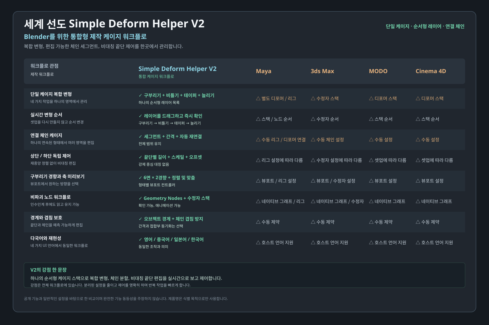

<div align="center">

# 심플 디포머 V2（Simple Deform Helper V2）

### 변형은 쉽게, 애니메이션도 쉽게

**첫 케이지는 약 0.04초 만에 만들어지고, 키 삽입 한 번으로 수십 개의 애니메이션 채널이 기록됩니다.**

[](https://github.com/AIGODLIKE/simple_deform_helper/releases)
[](https://www.blender.org/download/)
[](https://github.com/AIGODLIKE/simple_deform_helper/actions/workflows/validate.yml)

[English](README.md) · [简体中文](README.zh_HANS.md) · [日本語](README.ja_JP.md) · [릴리스](https://github.com/AIGODLIKE/simple_deform_helper/releases) · [버그 신고](https://github.com/AIGODLIKE/simple_deform_helper/issues/new?template=bug_report.yml)

</div>

<!-- 이 위치에 3~5초짜리 반복 데모 영상을 넣는 것을 추천합니다(구부리기 핸들 드래그 / 키 2개로 재생 / 체인 꼬리 흔들림). 첫 화면의 움직이는 이미지가 어떤 글보다 설득력이 있습니다. -->

네이티브 Simple Deform 모디파이어를 써 본 사람이라면 그 번거로움을 잘
압니다. 축은 하나씩 눌러 보며 찾고, 변형 원점은 엠프티를 만들어 직접
옮기고, 애니메이션은 모디파이어 패널에서 속성을 하나씩 키를 넣어야
합니다. 이 확장은 그 모든 과정을 눈에 보이는 변형 케이지 하나로
정리합니다. 케이지를 둔 곳에서 변형이 일어나고, 모든 파라미터에는 전용
핸들이 있어 드래그하는 순간 바로 적용됩니다. 애니메이션을 만들 때는 버튼
하나로 현재 프레임의 상태 전체가 기록됩니다.



"꼬리를 흔들리게 하기"를 예로 들면:

| | 기존 방식 | 이 확장 |
|---|---|---|
| 준비 | 아마튜어를 만들고 웨이트 페인팅, 또는 래티스와 모디파이어 설정 | 꼬리를 선택하고 **표준형 체인 케이지 추가** 클릭 |
| 포즈 | 본을 하나씩 회전 | 구부리기 핸들 드래그 |
| 키 넣기 | 속성을 하나씩 키프레임 삽입 | **키 삽입** 한 번 클릭 |
| 파일 전달 | 상대방에게 같은 리그나 애드온 환경이 필요 | 케이지는 일반 지오메트리 노드 모디파이어라서 확장 없이도 재생됩니다 |

## 시간이 절약되는 이유

- 모든 변형 파라미터에 뷰포트 핸들이 있습니다. 구부리기, 비틀기, 테이퍼,
  늘리기, 전단, FFD 포인트, 커브 가이드마다 색이 다른 전용 핸들이 있고,
  마우스를 올리면 이름이 표시됩니다. 값을 바꾸려고 모디파이어 패널을
  뒤질 필요가 없습니다.
- **키 삽입**은 활성 케이지의 상태를 현재 프레임에 한 번에 기록합니다.
  레이어 강도, 끝단 형태, FFD 포인트 오프셋과 영향도, 커브 가이드,
  케이지 크기, 컨트롤러 트랜스폼까지 수십 개의 채널이 버튼 하나로
  들어갑니다. **키 삭제**는 그 채널만 지우고 액션의 다른 키는 건드리지
  않습니다.
- 확정된 샷은 **메시 애니메이션 베이크**로 절대 셰이프 키가 담긴 독립
  메시로 구울 수 있습니다. 내보내기든 렌더 팜이든, 받는 쪽에는 이 확장이
  필요 없습니다.
- 케이지는 일반 지오메트리 노드 모디파이어입니다. 스택에 항상 표시되고
  순서도 자유롭게 바꿀 수 있으며, 확장을 꺼도 파일은 그대로 계산됩니다.
- 핸들 드래그 한 번이 실행 취소 한 단계입니다. 움직이지 않은 클릭은
  기록되지 않고, 애니메이션이 담긴 파일은 열자마자 바로 재생됩니다.
- 첫 케이지는 약 0.04초 만에 만들어지고, 8개 세그먼트 체인도 드래그 중
  재연결이 약 50밀리초라서 조작이 끊기지 않습니다.



비교 그림이 보여 주는 것은 이런 컨트롤이 하나의 Blender 워크플로에
얼마나 모여 있는가이지, 다른 소프트웨어로 개별 결과를 만들 수 없다는
뜻이 아닙니다. 제품 이름은 비교 대상을 식별하기 위해서만 사용했습니다.

## 60초 만에 첫 변형

1. **오브젝트 모드**에서 메시, 커브, 표면, 텍스트 오브젝트를 선택합니다.
2. `N` 키로 **심플 디포머 V2** 탭을 열고 **표준형 케이지 추가**를
   클릭합니다.
3. **변형 레이어**에서 **구부리기**를 선택한 채 뷰포트의 주황색 구부리기
   핸들을 드래그합니다. `Shift`는 미세 조정, `Ctrl`은 스냅입니다.
4. 방향이 다르면 **자동** 또는 `X+ / X- / Y+ / Y- / Z+ / Z-` 축을 지정하고
   **정렬 및 맞춤**을 클릭합니다. **구부리기 경향**을 켜고 아무 면의
   빨강/초록 화살표를 클릭해 구부러질 방향을 골라도 됩니다.
5. 다 됐으면 **오브젝트로 돌아가기**를 클릭합니다.

구부러진 면이 각져 보이면 케이지 스테이지 앞에서 변형 축 방향으로
지오메트리를 추가하세요. 패널이 토폴로지 부족을 알려 주지만, 몰래
세분화를 넣지는 않습니다.

## 30초 더해서 움직이게 하기

1. 시작 프레임에서 포즈를 잡고 **키 삽입**을 클릭합니다.
2. 타임라인을 몇 프레임 뒤로 옮겨 다른 포즈를 잡고 다시 클릭합니다.
3. 재생하세요. 케이지 파라미터는 일반 애니메이션처럼 보간되므로 그래프
   에디터에서 이징이나 반복도 자유롭습니다.

표준형, 체인, 전단, FFD, 커브 케이지는 물론 레거시 Simple Deform
모디파이어까지, 키를 넣는 버튼은 전부 같습니다.

샷이 확정되면 **메시 애니메이션 베이크**에서 프레임 범위, 샘플 간격,
이름을 정하면 깔끔한 셰이프 키 메시가 만들어집니다. 베이크 후 원본
오브젝트를 자동으로 숨길 수도 있습니다.

## 샷에 맞는 케이지 고르기

| 만들려는 애니메이션 | 시작할 버튼 | 얻는 것 |
|---|---|---|
| 국소적인 구부리기/비틀기/테이퍼/늘리기, 또는 여러 층 겹치기 | **표준형 케이지 추가** | 순서를 바꿀 수 있는 **구부리기 / 비틀기 / 테이퍼 / 늘리기** 레이어를 담은 케이지 하나. |
| 꼬리, 촉수, 케이블, 안테나, 척추 | **표준형 체인 케이지 추가** | 2–8개의 연결 세그먼트. 하류로 자동 재연결되고 이음새가 동기화됩니다. |
| 뱀, 덩굴, 깃발처럼 그린 경로를 따라 흐르는 움직임 | **커브 케이지 추가** | 편집 가능한 베지어 가이드. **직선 / 물결 / 사인파 / 나선** 라이브 프리셋과 애니메이션 가능한 단면. |
| 부드러운 눌림, 부풀림, 눌린 자국, 카툰식 스미어 | **FFD형 케이지 추가** | `2x2x2`부터 `6x6x6`까지의 래티스 케이지. 포인트별 영향도, 대칭 편집, 접힘 방지. |
| 이탤릭체 같은 평면 밀기 | **전단형 케이지 추가** | 평면 안에서 자유롭게 미끄러지는 전용 청록색 끝면 핸들. |
| 이미 Simple Deform을 쓰고 있는 기존 파일 | **Simple Deform 추가(레거시)** | 네이티브 모디파이어에 스테이지 인식 기즈모, 제한, 원점 컨트롤, 동일한 키/베이크 버튼을 더한 구성. |
| 래티스 오브젝트 | **Simple Deform 추가(레거시)** | 네이티브 모디파이어만 지원. 래티스의 케이지 변형은 의도적으로 미지원. |

전단과 FFD에도 체인 버튼이 있습니다(**전단형 체인 케이지 추가**,
**FFD형 체인 케이지 추가**). 커브 케이지가 단일 스테이지인 것은 의도된
설계입니다.

여러 오브젝트를 선택한 상태에서 케이지 추가를 클릭하면 라이브 병합체를
만들어 한꺼번에 변형합니다. `Ctrl` 클릭은 선택한 오브젝트마다 독립
케이지를 만듭니다.

## 애니메이션 도구 상자

| 도구 | 하는 일 |
|---|---|
| **키 삽입** | 활성 스테이지의 변형 상태 전체를 현재 프레임에 기록: 각 레이어의 강도와 방향, 전단 계수, 모든 FFD 포인트의 오프셋과 영향도, 커브 가이드 포인트와 전체 반지름/전체 비틀기와 범위, 끝단 스케일/오프셋, 케이지 크기, 스테이지 표시 상태, 컨트롤러 위치/회전. |
| **키 삭제** | 위 채널의 현재 프레임 키만 삭제합니다. 액션의 다른 내용은 그대로입니다. |
| **메시 애니메이션 베이크** | 지정한 프레임 범위(시작, 끝, 간격 조절 가능)에서 최종 결과를 샘플링해 절대 셰이프 키가 담긴 독립 메시를 생성합니다. 원본 오브젝트 자동 숨김 옵션 포함. |
| **스테이지 표시 애니메이션** | `stage_enabled`는 애니메이션 가능한 채널이라 케이지를 샷 중간부터 켤 수 있습니다. |
| **실행 취소 경계** | 핸들 드래그, 레이어 편집, 레거시 기즈모 조작이 각각 실행 취소 한 단계입니다. 드래그를 취소하면 이전 상태로 돌아갑니다. |
| **파일 로드 복구** | 애니메이션 케이지가 담긴 파일을 열면 자동으로 동기화가 복구됩니다. 빈 씬으로 시작한 뒤에 열어도 마찬가지입니다. |

키 삽입이 기록하는 것은 모두 일반 F-커브이고 **Simple Deform Helper**
채널 그룹에 모입니다. 그래프 에디터, 도프 시트, NLA에서 그대로 편집할 수
있고 드라이버도 걸 수 있습니다.

## 케이지별 사용법

### 표준형 케이지와 변형 레이어

표준형 케이지는 켜진 레이어를 위에서 아래로 계산하므로 순서가 결과를
바꿉니다:

```text
오브젝트 입력 -> 구부리기 -> 비틀기 -> 테이퍼 -> 늘리기 -> 독립 끝단 형태 -> 출력
```

- **변형 추가**로 레이어를 더하고, 위아래 화살표로 순서를 바꾸고, 눈
  아이콘으로 값을 유지한 채 잠시 끄고, `X`로 삭제합니다. **모두
  펼치기**를 켜면 여러 레이어를 나란히 놓고 조절할 수 있습니다.
- 레이어를 선택하면 그에 맞는 핸들이 뷰포트에 나타납니다.
- 자주 쓰는 순서: 구부리기 뒤에 비틀기를 두면 뒤틀린 파이프, 테이퍼 뒤에
  구부리기는 뿔이나 노즐, 늘리기 뒤에 구부리기는 탄성 있는 움직임에
  어울립니다. 두 안을 비교할 때는 레이어를 잠시 끄는 것이 가장 빠릅니다.
- **독립 끝단**: 상단과 하단의 길이, X/Z 스케일, X/Z 오프셋이 전부
  독립이라 중심 대칭이 강제되지 않습니다. **독립 끝단 재설정**으로 맞춤
  시점의 단면으로 되돌립니다.
- **공간 모드**는 케이지 밖의 동작을 정합니다: **제한**(케이지 끝에서
  이어짐), **케이지 내부**(안쪽만), **무제한**(전체로 이어짐),
  **체인**(상류를 고정한 채 이어짐).
- **원점**은 변형이 시작되는 위치입니다: **하단**, **중앙**, **대칭**,
  **상단**.
- 평소에는 컴팩트 패널로 충분합니다. 패널 머리글의 렌치 아이콘으로
  **프로페셔널 모드**를 켜면 변형 축, 독립 끝단, 숫자 컨트롤이
  나타납니다.

### 체인 케이지

- 한 번에 2–8개 세그먼트를 만듭니다. **체인**(연속) 또는 **독립**(각자의
  박스 안)을 고를 수 있고 간격도 둘 수 있습니다.
- **자동 재연결**은 상류의 변화를 하류로 전달합니다. **공유 끝단 스케일
  동기화**는 이음새 양쪽을 함께 스케일해서 갈라지지 않게 하고, 체인의
  바깥쪽 양 끝은 독립으로 남습니다.
- **체인 케이지로 세분**은 다 만들어 둔 표준형 케이지를 전체 범위를
  바꾸지 않고 체인으로 나눕니다. 구부리기/비틀기 값은 각 세그먼트에
  배분됩니다.
- **일괄 편집**은 라이브 미리보기가 있는 대화 상자에서 체인 전체(또는
  처음–활성, 활성–끝)를 한꺼번에 조절합니다: 끝단 스케일, 끝단 오프셋,
  간격, 변형 파라미터, 스테이지 표시. 취소하면 전부 원래대로 돌아옵니다.
- 모디파이어 스택을 이리저리 끌어도 세그먼트 순서는 흐트러지지 않습니다.
  한 번에 4개 이상을 만들면 뷰포트 성능 안내가 표시되지만 생성을 막지는
  않습니다.

### 커브 케이지

- 가이드는 진짜 베지어 커브이고 뷰포트에서 바로 편집합니다. 포인트를
  클릭/박스 선택할 수 있고, 이동/회전/스케일/반지름/비틀기 모두 Blender의
  비례 편집이 적용됩니다. **전체 커브 감쇠**를 켜면 한 번의 편집을 가이드
  전체로 퍼뜨릴 수 있습니다.
- **라이브 프리셋**(직선, 물결, 사인파, 나선)은 진폭, 주기, 위상, 포인트
  수를 드래그하는 동안 즉시 갱신되고, 결과는 언제나 계속 편집 가능한
  커브로 남습니다.
- **단면**은 가이드 위 아무 위치에나 애니메이션 가능한 반지름/비틀기
  스테이션을 추가합니다. **단면 자동 균등 배치**가 간격을 일정하게
  유지합니다. 전체 반지름/전체 비틀기는 겹쳐서 적용되고 포인트별 값을
  덮어쓰지 않습니다.
- 가이드의 변형은 바인딩 때 기록한 정지 형태를 기준으로 계산됩니다. 지금
  형태를 새 정지 상태로 삼고 싶으면 **커브 재바인딩**을 클릭하세요.

### FFD 케이지

- 축마다 해상도는 `2–6` 포인트(최대 `6x6x6`)이고 언제든 바꿀 수 있으며,
  이미 조절한 오프셋은 사라지지 않습니다.
- 포인트/라인/면의 세 가지 선택 모드, 박스 선택, 전체/해제/반전, 그룹
  드래그를 지원합니다. **중공 FFD**는 내부 포인트를 숨기고 제외합니다.
- **대칭 편집**은 케이지 로컬 U/V/W 중심면을 기준으로 미러링합니다.
- 포인트별 **영향도**(0–1)는 각 컨트롤 포인트가 메시를 움직이는 세기를
  정합니다. 영향도 자체에도 키를 넣을 수 있어서 영향 범위를 시간에 따라
  바꿀 수 있습니다.
- **FFD 안전 보호**의 **접힘 방지** 모드는 편집을 마지막으로 뒤집히지
  않은 래티스 상태 안으로 제한합니다. 아무리 빠르게 포즈를 잡아도 메시가
  뒤집히지 않습니다.
- **네이티브 래티스 편집**은 프록시 위에서 Blender 기본 래티스 편집
  모드를 엽니다. 편집과 선택은 케이지 상태로 다시 동기화됩니다.

### 여러 오브젝트를 병합해 한 번에 변형

- **선택 항목을 변형용으로 병합**(또는 **변형용 컬렉션 병합**)은 메시,
  커브, 표면, 텍스트, 메타볼, 헤어 커브, 포인트 클라우드를 라이브
  병합체로 만듭니다. 원본은 링크된 채 병합 결과를 계속 갱신합니다.
- 병합 결과의 아무 부분이나 더블클릭하면 해당 원본 오브젝트를 편집할 수
  있습니다. 편집 중에는 파란 미리보기가 전체 모디파이어 스택을 거친 최종
  상태를 보여 줍니다.
- **최종 상태 원본에 케이지 추가**는 병합체의 현재 스택 뒤에 원본 마스크가
  걸린 케이지를 맞춥니다. 캐릭터의 한 부분만 변형하고 나머지는 건드리지
  않습니다.
- **병합 오브젝트로 돌아가기**로 편집을 끝냅니다. 링크를 해제하면
  병합체가 제거되고 원본이 복원됩니다.

## 뷰포트 핸들 빠른 참조

| 핸들 | 의미 | 조작 |
|---|---|---|
| 주황색 이중 화살표 | 구부리기 각도 | 드래그. `Shift` 미세 조정, `Ctrl` 스냅. |
| 큰 주황색 링 | 구부리기 방향 | **비틀기 표시**를 켠 뒤 드래그. |
| 큰 보라색 호 | 비틀기 각도 | 중심 주위로 드래그. 이음새를 넘어도 각도가 이어집니다. |
| 호박색 핸들 | 테이퍼 계수 | 드래그. `Shift` 미세 조정, `Ctrl` 스냅. |
| 초록색 핸들 | 늘리기 계수 | 드래그. `Shift` 미세 조정, `Ctrl` 스냅. |
| 노란 상단 / 호박색 하단 | 한쪽 경계만 이동 | 케이지 축을 따라 드래그. **오브젝트 경계 안으로 제한**을 따릅니다. |
| 청록 왕관형 / 초록 받침형 | 한쪽 끝의 형태만 변경 | 드래그로 스케일. `Alt` 화면 X, `Shift` 화면 Y, `Alt+Shift` 자유 이동, `Ctrl` 스냅. |
| 청록 사방향 평면 | 전단 끝면 밀기 | 끝면 안에서 드래그. `Alt`는 케이지 X, `Shift`는 케이지 Z 고정, `Ctrl` 스냅. |
| 분홍/청록 래티스 포인트 | FFD 컨트롤 포인트 | 선택 그룹을 함께 드래그. 박스 선택, 전체/해제/반전 지원. |
| 흰색 커브 포인트와 핸들 | 커브 가이드 | 클릭, 박스 선택, 드래그. 비례 편집 적용. |
| 빨강 / 초록 화살표 | 각 면의 구부리기 경향 | 클릭해서 선택. `Ctrl`을 누르는 동안 전부 표시. |
| RGB 다이아몬드 / 링 | X, Y, Z 축의 양/음 방향 | 다이아몬드가 양의 방향, 링이 음의 방향. |

어느 핸들이든 마우스를 올리면 이름이 표시됩니다. 헬퍼 오브젝트는
**Simple Deform Controls** 컬렉션에 모여 있고 필요할 때만 나타납니다.
케이지 와이어를 오브젝트 너머로 보이게 할지는 **앞에 표시** 토글로
바꿉니다.

## 설치

1. [릴리스 페이지](https://github.com/AIGODLIKE/simple_deform_helper/releases)에서
   `simple_deform_helper-2.7.48.zip`을 내려받습니다. GitHub가 자동 생성한
   Source code ZIP은 쓰지 마세요.
2. Blender에서 **편집 > 환경 설정 > 확장 프로그램 얻기**를 열고
   **디스크에서 설치**로 ZIP을 선택합니다.
3. 자동으로 켜지지 않으면 **Simple Deform Helper**를 직접 켭니다.
4. 3D 뷰포트에서 `N`을 누르고 **심플 디포머 V2** 탭을 엽니다.

설치본은 하나만 유지하세요. 다른 저장소에 같은 확장 ID가 남아 있으면 이
버전은 활성화를 거부하고 어느 것이 중복인지 알려 줍니다. 이전 사본을
제거하고 Blender를 재시작한 뒤 다시 켜면 됩니다. 이 버전이 Blender
Extensions 공식 목록에 올라간 뒤에는 Blender 내장 **업데이트**를
우선하세요. 중요한 프로덕션 파일을 업데이트하기 전에는 버전 번호를 붙인
`.blend` 사본을 먼저 저장해 두세요.

## 호환성

| 항목 | 지원 |
|---|---|
| Blender | **5.0.0 이상**. CI가 최소 지원 버전과 현재 지원 버전을 검증합니다. |
| 케이지 대상 | 메시, 커브, 표면, 텍스트. |
| 병합 소스 | 메시, 커브, 표면, 텍스트, 메타볼, 헤어 커브, 포인트 클라우드. |
| 래티스 | 레거시 Simple Deform만 지원하며 명확한 안내가 표시됩니다. |
| 엔진 | 케이지는 지오메트리 노드, 레거시 모드는 네이티브 Simple Deform. |
| 언어 | 영어, 중국어 간체, 일본어, 한국어. |
| 애니메이션 | 변형 레이어 값, FFD 포인트와 영향도, 커브 가이드와 단면, 끝단 형태, 케이지 크기, 트랜스폼, 스테이지 표시 상태, 레거시 모디파이어 속성. |
| 저장 결과 | 생성된 노드 스테이지는 확장 없이도 계속 계산됩니다. 전용 UI와 컨트롤러 관리에는 확장이 필요합니다. |

## 자주 묻는 질문

| 증상 | 확인할 것 |
|---|---|
| "심플 디포머 V2" 탭이 없음 | 확장이 켜져 있는지 확인하고 3D 뷰포트에서 `N`을 누릅니다. 이전 버전을 교체했다면 Blender를 한 번 재시작합니다. |
| 케이지를 추가해도 변화가 없음 | 오브젝트 모드에서 지원 오브젝트를 선택했는지 확인합니다. 복제 과정에서 노드 스테이지가 사라졌다면 낡은 스테이지를 지우고 새로 추가합니다. |
| 재생해도 메시가 움직이지 않음 | 케이지 파라미터에 키가 실제로 들어 있는지 확인합니다(최소 두 프레임에서 **키 삽입**). 애니메이션 파일은 열 때 자동으로 다시 동기화됩니다. |
| 구부린 면이 각짐 | 케이지 스테이지 앞에서 변형 축 방향으로 지오메트리를 추가합니다. |
| 케이지가 오브젝트와 안 맞음 | 스테이지를 선택해 축을 정한 뒤 **정렬 및 맞춤** 또는 **체인 정렬 및 맞춤**을 클릭합니다. |
| 체인에 이음새가 보임 | **자동 재연결**을 켜고 **체인 다시 연결**을 클릭한 뒤 **앞 간격**과 공유 끝단 스케일을 확인합니다. |
| 핸들이 안 보임 | 대상 또는 케이지와 해당 변형 레이어를 선택하고, 구부리기 경향 / 비틀기 표시 / 끝단 / 길이 옵션을 켭니다. |
| 래티스에 케이지를 못 붙임 | 의도된 제한입니다. **Simple Deform 추가(레거시)**를 사용하세요. |

## 데이터 및 제거

케이지 스테이지를 삭제하면 그 스테이지가 관리하는 지오메트리 노드
모디파이어와 헬퍼 오브젝트도 함께 삭제됩니다. 확장을 제거해도 `.blend`
파일 안에 생성된 노드 그룹은 자동으로 지워지지 않습니다. 먼저 **변형
스택 제거**를 실행한 뒤 사본으로 저장하세요.

## 피드백과 기여

[버그 신고 양식](https://github.com/AIGODLIKE/simple_deform_helper/issues/new?template=bug_report.yml)에
확장과 Blender 버전, OS/GPU/입력 장치, 정확한 재현 단계와 모디파이어
순서, 콘솔 출력, 개인 정보를 제거한 최소 `.blend` 파일 또는 짧은 영상을
첨부해 주세요.

Pull Request는 Blender 5.0+ 호환을 유지하고, 서드파티 런타임 의존성을
추가하지 않으며, 사용자에게 보이는 텍스트의 4개 언어 카탈로그를 함께
갱신하고, 저장소 검증 워크플로를 통과해야 합니다.

## 라이선스

심플 디포머 V2는 [`blender_manifest.toml`](blender_manifest.toml)에 선언된
대로 **GPL-3.0-or-later**로 배포됩니다. Maya, 3ds Max, MODO, Cinema 4D,
Blender 및 각 상표는 각 소유자의 자산이며, 식별과 워크플로 비교를
위해서만 언급했습니다.
