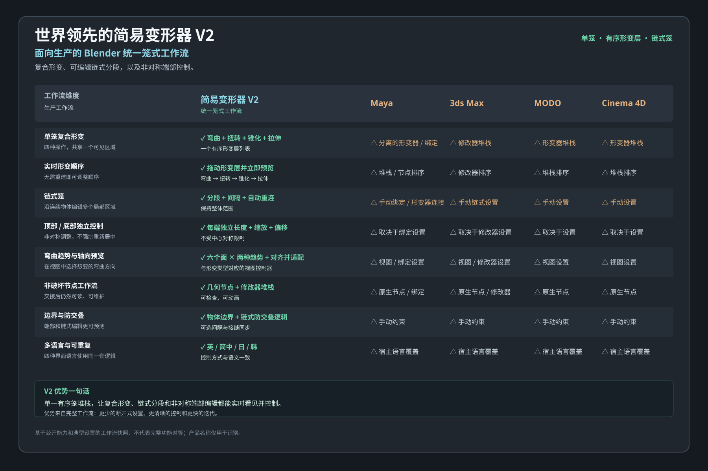

<div align="center">

# 简易变形器 V2（Simple Deform Helper V2）

### 简单变形，简单动画

**让物体变形以及变形动画变得更加容易。**

[](https://github.com/AIGODLIKE/simple_deform_helper/releases)
[](https://www.blender.org/download/)
[](https://github.com/AIGODLIKE/simple_deform_helper/actions/workflows/validate.yml)

[English](README.md) · [日本語](README.ja_JP.md) · [한국어](README.ko_KR.md) · [发行版](https://github.com/AIGODLIKE/simple_deform_helper/releases) · [提交问题](https://github.com/AIGODLIKE/simple_deform_helper/issues/new?template=bug_report.yml)

</div>


如果你至今都没有掌握物体变形&变形动画，这不是你的错，而是工具不够好用。相信我，这个工具能够让你获得地球上最好用的变形器体验。


## 快速开始

1. 安装：从[发行版页面](https://github.com/AIGODLIKE/simple_deform_helper/releases)下载（或未来从Blender extension直接安装，目前这个工具有太多人在用了，我需要收集足够的样本确保它的稳定性才会推送正式版）
2. 位置：打开N面板，找到简易形变器V2.
3. 添加：选择需要变形的物体(支持多物体，但不要选太多)，点击添加标准型笼。
4. 控制：拖拽笼的操控器。
5. 动画：点击位于底部的插入关键帧，即可记录当前状态。
6. 烘焙：点击烘焙网格动画一键烘焙。(如果你需要导出，或者希望提升动画性能，可以选择将动画烘焙。)
7. 大功告成，快去探索其它类型笼！
   
## 详细手册

### 功能定义

#### 变形笼

为了让变形&变形范围更直观，我们使用了变形笼概念。虽然变形笼类型有区别，但它们在行为上是一致的：将变形物体包裹，然后进行变形。

以下是四种变形笼

**标准型笼**：又称多层形变笼，你可以将弯曲、扭曲和拉伸以及切变效果任意组合产生变形效果。

**斜切型笼**：让物体能够沿任意切向变形。

**FFD型笼**：晶格变形的升级版，支持点/边/面，以及权重场，甚至是滑移。

**曲线型笼**：对人类更加舒适的曲线控制物体变形

#### 链式笼

当你需要分段使用多个笼，又需要它们彼此关联（例如防穿插、切面变形协同、变形接力），这个时候你就可以创建链式笼，或者先创建变形笼，再将其细分为多个链式笼

### 标准型笼

支持弯曲、扭曲、锥化、拉伸、切变效果任意组合产生变形效果。（效果从上往下依次叠加，每种类型只支持出现一次，如需要多重请再添加一个标准型笼）

#### 弯曲

控制物体进行圆弧弯曲

|参数|说明|
|---|---|
|弯曲角度|控制弯曲的力度，360°时为圆|
|扭转角度|控制弯曲的扭转|

##### 重要特性：一键设置正确弯曲方向

弯曲方向不对？启动显示轴向切换，根据弯曲方向Gizmo，选择方向。（弯曲的轴向优先级最高，即使有其他的形变也会以弯曲为最优先显示）


##### 重要特性：弯曲起始点

默认的弯曲开始位置取决于笼原点，默认底部，你可以设置顶部、中心和对称(从中心开始但弯曲方向相反)


#### 扭曲

控制物体进行扭曲。（方向为从底部到顶部，起始点为笼原点）

|参数|说明|
|---|---|
|扭曲角度|控制扭曲角度，每360度为1周|

#### 扭曲

控制物体进行扭曲。（方向为从底部到顶部，起始点为笼原点）

|参数|说明|
|---|---|
|扭曲角度|控制扭曲角度，每360度为1周|

#### 锥化

控制物体进行锥化。

|参数|说明|
|---|---|
|锥化系数|控制锥化强度|

##### 注意事项：调整边界的尖端问题

当调整锥化系数到一些特殊值（底：-1 |顶：1|中心：2，-2|对称：-2），会产生尖端。尖端会彻底闭合网格使其变成一个点。

这会在你调整顶部/底部（取决于尖端位置），让模型看起来像是被挤压了，这并不是算法的问题，而是尖端之上/下，不存在网格，所以不要边界调整为此感到奇怪。


#### 拉伸

控制物体进行拉伸。（方向为从底部到顶部，起始点为笼原点）

|参数|说明|
|---|---|
|拉伸系数|控制拉伸的强度|
|维持体积|开启后体积物体将会受到体积制约。意味着拉长会导致物体变细，压小会导致物体变扁|

#### 切变

让物体沿切向变形。（方向为从底部到顶部，起始点为笼原点）

|参数|说明|
|---|---|
|拉伸系数|控制拉伸的强度|
|维持体积|开启后体积物体将会受到体积制约。意味着拉长会导致物体变细，压小会导致物体变扁|

### 斜切型笼

与标准型切变一致。

### FFD型笼

更高级且更好操作的的晶格变形。支持点/边/面，以及权重场，甚至是滑移。

#### 点/边/面

Blender原生晶格只支持点，在这里追加了边和面。意味着你不需要一直用顶点逻辑思考。

#### 滑动

选中点/边/面，按GG,即可直接进入滑动模式，滑动方向取决于光标所在的相邻边/切面。


#### 对称

开启后，将会根据选择的轴，同步选择对称的点/边/面。

#### FFD点数&插值

晶格点数&插值，默认UVW统一设置。可关闭。

#### FFD点权重(超推荐！)

在几乎所有3D软件中，FFD点的权重都是均等的，意味着我们做一些简单动画会比较麻烦，例如FFD让一个物体变形，然后再还原回去。现在你可以随时通过控制点权重而不是让晶格改变形态的方式实现这一点。

#### 编辑模式

物体编辑=使用原生编辑，选择控制Gizmo时自动进入，ESC/双击空白/右键退出。
原生编辑=点击后进入原生晶格编辑，再次点击原生编辑退出。

#### 中空FFD

开启后，仅显示且仅考虑外层控制。

#### 重置

恢复到默认FFD，适合做一些重置还原动画，或者撤销状态。

### 曲线型笼

根据物体创建一根与之匹配的曲线，然后进行变形控制

#### 模式选择

|模式|说明|
|---|---|
|曲线模式|曲线优先，曲线可以改变笼的尺寸，物体将会被拉伸对齐曲线|
|笼模式|笼优先，曲线不会改变笼尺寸，且笼会维持在物体创建笼时的沿曲线长度|

#### 绑定当前引导线

点击后将仅重置物体变形状态，引导线将会沿用其变形状态重新对物体进行控制

#### 闭合曲线

开启后控制曲线将闭合

#### 维持体积

开启后，拉长会变细，拉短会变粗。

#### 曲线控制参数

|参数|说明|
|---|---|
|引导线分辨率|控制曲线的分辨率|
|半径|控制曲线的|
|半径|控制曲线的|


### 链式笼


#### 通用属性

你的物体需要多段变形时，链式笼就是你的首选。这是它的特性。

|特性|说明|
|---|---|
|变形继承|从笼起始点，依次传递变形控制|
|边界协同|开启后相邻边界的缩放控件将会彼此协同|
|防越界|相邻笼不会穿越彼此的边界|

#### 标准型


## 它凭什么省时间

- 所有变形参数在视口里都有自己的手柄：弯曲、扭曲、锥化、拉伸、斜切、
  FFD 点、曲线引导线各一套，颜色不同，悬停会显示名字。调参数不用去
  修改器面板里翻。
- **插入关键帧**一次把活动笼的状态全记到当前帧：层强度、端部形态、
  FFD 点偏移和影响力、曲线引导、笼尺寸、控制器变换，几十条通道一个
  按钮。**删除关键帧**只删这些通道，不碰动作里其他的键。
- 定稿后用**烘焙网格动画**把整段变形烘成带形态键的独立网格。拿去导出、
  交给渲染农场，对方不需要装这个扩展。
- 笼是普通的几何节点修改器，一直摆在堆栈里，顺序随便调。停用扩展，
  文件照常算。
- 拖一次手柄记一步撤销，点了没动就不记录。带动画的文件打开就能直接播。
- 第一个笼约 0.04 秒建好；8 段链式笼边拖边重连，一次大约 50 毫秒，
  不会拖一下卡一下。



对比图说的是这些控制集中在一条 Blender 工作流里的程度，不是说别的软件
做不出某个效果。产品名称仅用于标识对比对象。

## 60 秒完成第一次变形

1. 在**物体模式**选中网格、曲线、曲面或文本物体。
2. 按 `N` 打开 **简易变形器V2** 标签，点击 **添加标准型笼**。
3. 在**形变层**里保留**弯曲**，直接拖视口里的橙色弯曲手柄。按住 `Shift`
   精调，按住 `Ctrl` 吸附。
4. 方向不对？选**自动**或指定 `X+ / X- / Y+ / Y- / Z+ / Z-` 轴，点
   **对齐并适配**；也可以打开**弯曲趋势**，在任意面上点红/绿箭头选
   弯曲走向。
5. 调完点 **返回物体**。

弯曲出现分面的话，在笼阶段之前沿变形轴加几段几何。面板会提示拓扑过低，
但不会偷偷帮你加细分。

## 再用 30 秒让它动起来

1. 在起始帧摆好姿势，点 **插入关键帧**。
2. 时间轴往后走几帧，再摆一个姿势，再点一次。
3. 播放。笼参数像普通动画一样插值，进曲线编辑器调缓动、做循环都行。

标准型、链式、斜切、FFD、曲线，加上传统 Simple Deform 修改器，K 帧用的
都是同一组按钮。

定版之后点**烘焙网格动画**，选好帧范围、采样步长和名字，得到一个干净的
形态键网格，源物体可以在烘焙后自动隐藏。

## 按镜头需求选择变形笼

| 你要做的动画 | 从这里开始 | 得到什么 |
|---|---|---|
| 一处局部弯曲/扭曲/锥化/拉伸，或多层叠加 | **添加标准型笼** | 一个笼内有序、可重排的**弯曲 / 扭曲 / 锥化 / 拉伸**层。 |
| 尾巴、触手、缆线、天线、脊柱 | **添加标准型链式笼** | 2–8 个相连分段，自动向下游重连，接缝同步。 |
| 沿一条可画的路径流动，比如蛇、藤蔓、旗帜 | **添加曲线型笼** | 可编辑的贝塞尔引导线，**直线 / 波浪 / 正弦波 / 螺旋**实时预设，截面可动画。 |
| 软性挤压、鼓包、凹陷、卡通拉丝 | **添加 FFD 型笼** | `2x2x2` 到 `6x6x6` 的晶格笼，逐点影响力、对称编辑和防翻折保护。 |
| 整体斜切滑移，比如斜体字效果 | **添加斜切型笼** | 专用青色端面手柄，在平面内自由滑动。 |
| 已经用了 Simple Deform 的旧文件 | **添加简易形变修改器（传统）** | Blender 原生修改器，外加阶段感知 Gizmo、限制、原点控制和同一组插帧/烘焙按钮。 |
| 晶格物体 | **添加简易形变修改器（传统）** | 仅支持原生修改器；晶格有意不支持笼式变形。 |

斜切和 FFD 也有对应的链式按钮（**添加斜切型链式笼**、**添加 FFD 型
链式笼**）；曲线笼只有单段，这是有意设计。

选中多个物体时，点添加笼会先创建一个实时合并体再统一变形；按住 `Ctrl`
点击则为每个选中物体各建一个独立笼。

## 动画工具箱

| 工具 | 作用 |
|---|---|
| **插入关键帧** | 把活动阶段的完整变形状态记录到当前帧：各层强度与方向、斜切系数、每个 FFD 点的偏移与影响力、曲线引导点及全局半径/扭转与范围、端部缩放/偏移、笼尺寸、阶段可见性、控制器位置/旋转。 |
| **删除关键帧** | 只移除上述通道在当前帧的键，动作里其他内容不动。 |
| **烘焙网格动画** | 在指定帧范围（起始、结束、步长可调）采样最终结果，生成带绝对形态键的独立网格，可选自动隐藏源物体。 |
| **阶段可见性动画** | `stage_enabled` 是可动画通道，变形笼可以在镜头中途才生效。 |
| **撤销边界** | 每次手柄拖动、每次层编辑、每次传统 Gizmo 操作都是一步撤销；取消拖动会恢复进入前的状态。 |
| **文件加载恢复** | 打开带动画笼的文件时自动恢复同步，Blender 从空场景启动后再打开文件也一样。 |

插入关键帧写入的都是普通 F 曲线，统一放在 **Simple Deform Helper**
通道组里，在曲线编辑器、摄影表、NLA 里正常编辑，也能挂驱动器。

## 各类变形笼的用法

### 标准型笼与形变层

标准型笼自上而下计算启用的层，顺序会改变结果：

```text
物体输入 -> 弯曲 -> 扭曲 -> 锥化 -> 拉伸 -> 独立端部形态 -> 输出
```

- **添加形变**追加一层；上下箭头调整顺序；眼睛按钮临时静音但保留数值；
  `X` 删除；**全部展开**可以并排调多层参数。
- 选中某一层，视口中就会出现它对应的手柄。
- 常用顺序：先弯后扭适合带扭转的弯管，先锥化后弯曲适合角和喷嘴，
  先拉伸后弯曲适合弹性动作。想对比两个方案，静音一层是最快的方式。
- **独立端部**：顶部和底部的长度、X/Z 缩放、X/Z 偏移全部独立，不强制
  中心对称；**重置独立端部**恢复适配时的截面。
- **空间模式**决定笼外区域的行为：**受限**（从笼端延续）、**框内**
  （只影响笼内）、**无限**（全范围延续）、**链式**（保持上游前缀稳定）。
- **原点**决定变形从哪里开始：**底部**、**中心**、**对称**、**顶部**。
- 紧凑面板够日常使用；点面板标题的扳手图标开**专业模式**，会多出
  变形轴、独立端部和数值控制。

### 链式笼

- 一次创建 2–8 段，**链式**（连续）或**独立**（各管各的盒子），可以留
  间隔。
- **自动重新连接**把上游变化传播到下游；**同步接缝端部缩放**让相邻
  两段的接缝一起缩放，不会裂开，链条最外侧两端保持独立。
- **细分为链式笼**把一个调好的标准型笼拆成链，整体范围不变，弯曲/扭曲
  值分配到各分段。
- **批量编辑**在一个带实时预览的弹窗里调整整条链（或首段到活动段、
  活动段到末段）：端部缩放、端部偏移、间隔、某个形变参数或阶段可见性。
  点取消就完整恢复。
- 在修改器面板里拖动堆栈顺序，链段也不会乱；一次建超过三段时面板会
  提示注意视口性能，但不拦着你建。

### 曲线笼

- 引导线是真正的贝塞尔曲线，直接在视口里编辑：点选、框选控制点，
  移动/旋转/缩放/半径/扭转都支持 Blender 的衰减编辑；开**全域衰减**
  可以把一次编辑摊到整条引导线上。
- **实时预设**（直线、波浪、正弦波、螺旋）在拖动幅度、圈数、相位或
  点数时即时更新，结果始终是可以继续编辑的曲线。
- **截面**可以在引导线任意位置添加可动画的半径与扭转站点；
  **自动均分截面**保持等距分布。全局半径/全局扭转以叠加方式生效，
  不覆盖逐点数值。
- 引导线的变形相对于绑定时记录的静止形状计算；想让当前形状成为新的
  静止状态，点**重新绑定曲线**。

### FFD 笼

- 每轴分辨率 `2–6` 点（最多 `6x6x6`），随时可改，已调好的偏移不丢。
- 点/线/面三种选择模式，支持框选、全选/全不选/反选和成组拖动；
  **中空 FFD**隐藏并排除内部点。
- **对称编辑**沿笼局部 U/V/W 中心平面镜像修改。
- 逐点**影响力**（0–1）控制每个控制点对网格的作用强度，影响力本身也能
  K 帧，作用范围可以随时间变化。
- **FFD 安全保护**里可选的**防止翻折**模式，会把编辑限制在最后一个
  未翻折的晶格状态内，摆姿势再快也不会把网格翻过去。
- **原生晶格编辑**在代理上打开 Blender 自带的晶格编辑模式，习惯原生
  工具的可以用；编辑和选择会同步回笼状态。

### 多个物体合并后统一变形

- **合并选中对象用于形变**（或**合并集合用于形变**）把网格、曲线、
  曲面、文本、融球、毛发曲线和点云源合成一个实时合并体，源物体保持
  链接并持续更新合并结果。
- 双击合并结果的任意部分即可编辑对应源物体；编辑期间蓝色预览显示它
  经过完整修改器堆栈后的最终状态。
- **向最终态来源添加笼**在合并体当前堆栈之后拟合一个带来源遮罩的笼，
  只变形角色的一个部件，其余部分不受影响。
- **返回合并体**结束编辑；解除链接可移除合并体并恢复源物体。

## 视图手柄速查

| 手柄 | 含义 | 操作 |
|---|---|---|
| 橙色双箭头 | 弯曲角度 | 拖动；`Shift` 精调；`Ctrl` 吸附。 |
| 大型橙色圆环 | 弯曲方向 | 开启**显示扭转**后拖动。 |
| 大紫色圆弧 | 扭曲角度 | 绕中心拖动，跨过接缝角度依然连续。 |
| 琥珀色手柄 | 锥化系数 | 拖动；`Shift` 精调；`Ctrl` 吸附。 |
| 绿色手柄 | 拉伸系数 | 拖动；`Shift` 精调；`Ctrl` 吸附。 |
| 黄色顶部 / 琥珀色底部 | 只移动一端边界 | 沿笼轴拖动；受**限制在物体边界内**约束。 |
| 青色冠形 / 绿色托盘形 | 只改变一端形态 | 拖动缩放；`Alt` 屏幕 X；`Shift` 屏幕 Y；`Alt+Shift` 自由移动；`Ctrl` 吸附。 |
| 青色四向平面 | 斜切端面滑移 | 在端面内拖动；`Alt` 锁笼 X；`Shift` 锁笼 Z；`Ctrl` 吸附。 |
| 粉/青色晶格点 | FFD 控制点 | 成组拖动已选点；支持框选和全选/全不选/反选。 |
| 白色曲线点与手柄 | 曲线引导 | 点选、框选、拖动；支持衰减编辑。 |
| 红 / 绿箭头 | 每个面上的弯曲趋势 | 点击选择；按住 `Ctrl` 保持全部可见。 |
| RGB 菱形 / 圆环 | 正 / 负 X、Y、Z 轴 | 菱形为正向，圆环为负向。 |

悬停任何手柄都会显示名称。辅助物体集中在 **Simple Deform Controls**
集合里，需要时才出现。笼线框是否穿透物体显示由**显示在前方**开关控制。

## 安装

1. 从[发行版页面](https://github.com/AIGODLIKE/simple_deform_helper/releases)
   下载 `simple_deform_helper-2.7.48.zip`；不要用 GitHub 自动生成的
   Source code ZIP。
2. 在 Blender 里打开 **编辑 > 偏好设置 > 获取扩展**，选**从磁盘安装**，
   选中该 ZIP。
3. 没有自动启用的话，手动启用 **Simple Deform Helper**。
4. 在 3D 视图按 `N`，打开 **简易变形器V2** 标签。

只保留一个安装副本。如果另一个仓库里还有相同扩展 ID，这个版本会拒绝
启用并告诉你重复的是哪一个：移除旧副本、重启 Blender 再启用即可。等该
版本发布到 Blender Extensions 官方条目后，优先用 Blender 内置的**更新**。
更新重要生产文件前，先存一份带版本号的 `.blend` 副本。

## 兼容性

| 项目 | 支持情况 |
|---|---|
| Blender | **5.0.0 及更新版本**；CI 验证最低与当前支持版本。 |
| 笼式目标 | 网格、曲线、曲面、文本。 |
| 合并来源 | 网格、曲线、曲面、文本、融球、毛发曲线、点云。 |
| 晶格 | 仅传统 Simple Deform，并有明确提示。 |
| 引擎 | 笼式由几何节点驱动；传统模式用 Blender 原生 Simple Deform。 |
| 语言 | 英语、简体中文、日语、韩语。 |
| 动画 | 形变层数值、FFD 点与影响力、曲线引导与截面、端部形态、笼尺寸、变换、阶段可见性、传统修改器属性。 |
| 保存结果 | 生成的节点阶段在没有扩展时仍会计算；自定义界面和控制器维护需要扩展。 |

## 常见问题

| 现象 | 检查方式 |
|---|---|
| 没有"简易变形器V2"标签 | 确认扩展已启用，在 3D 视图按 `N`；替换旧版本后重启一次 Blender。 |
| 添加笼后没有效果 | 确认在物体模式且选中了支持的物体；复制出来的物体丢了节点阶段时，删掉失效阶段重新添加。 |
| 播放时网格不动 | 确认笼参数确实带键（至少在两帧上点过**插入关键帧**）；带动画的文件打开时会自动重新同步。 |
| 弯曲出现分面 | 在笼阶段之前沿变形轴加几何分段。 |
| 笼和物体对不上 | 选中该阶段并设置轴向，然后点**对齐并适配**或**对齐并适配链式笼**。 |
| 链出现接缝 | 开**自动重新连接**，点**重新连接笼链**，检查**前间隔**和接缝端部缩放。 |
| 找不到某个手柄 | 选中目标或笼以及对应的形变层，再开对应的弯曲趋势 / 显示扭转 / 端部 / 长度选项。 |
| 晶格不能加笼 | 有意限制；用**添加简易形变修改器（传统）**。 |

## 数据与卸载

删除一个笼阶段会移除它管理的几何节点修改器和辅助物体。卸载扩展**不会**
自动清除 `.blend` 文件里已生成的节点组：先执行**删除形变堆栈**，再另存
副本。

## 反馈与贡献

请用[问题模板](https://github.com/AIGODLIKE/simple_deform_helper/issues/new?template=bug_report.yml)，
附上：扩展与 Blender 版本、系统/GPU/输入设备、精确的复现步骤与修改器
顺序、控制台输出，以及去掉隐私内容的最小 `.blend` 文件或短视频。

Pull Request 需要保持 Blender 5.0+ 兼容、不引入第三方运行时依赖、为
用户可见文本同步更新全部四套翻译，并通过仓库验证工作流。

## 其他

·由于我只在看动漫的时候粗略的学习了一点点的英文、中文、日文和韩文。所以文档主要由英语组成（如果有错误一定要告诉我啊）。
·同时，世界上有非常多的语言，如果你愿意为你的母语提交翻译，我将很乐意将它合并进来。
·有好的想法务必告诉我，如果能提交代码就更好了。
·这个工具从未收费也不存在收费版本。
·希望大家都能快乐的使用[Blender](https://fund.blender.org/)！
