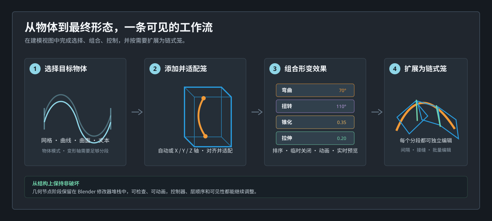

<div align="center">

# 世界领先的简易变形器 V2

**面向 Blender 生产流程的形变工具：在可见、可编辑的笼中组合弯曲、扭转、锥化和拉伸。**

[](https://github.com/AIGODLIKE/simple_deform_helper/releases/download/v2.4.6/simple_deform_helper-2.4.6.zip)
[](https://www.blender.org/download/)
[](https://github.com/AIGODLIKE/simple_deform_helper/actions/workflows/validate.yml)

[English](README.md) · [日本語](README.ja_JP.md) · [한국어](README.ko_KR.md) · [发行版](https://github.com/AIGODLIKE/simple_deform_helper/releases) · [提交问题](https://github.com/AIGODLIKE/simple_deform_helper/issues/new?template=bug_report.yml)

</div>

简易变形器 V2 把分散的修改器参数整理成一条直接建模的工作流：笼显示形变发生的**位置**，视图控制柄显示会改变的**内容**，形变层列表显示每一步的**执行顺序**。



## 它强在哪里

单独做一次弯曲并不难，难的是多个形变、长物体分段、非对称端部和后续交接。V2 针对这些生产问题提供了明确的控制面。

| 生产需求 | V2 的解决方式 |
|---|---|
| 复合形变 | 一个**标准型**笼可放入有序的**弯曲、扭转、锥化和拉伸**，支持排序、临时关闭、动画和实时预览。 |
| 长条或连续物体 | **链式笼**支持 2-8 个分段、间隔、自动重连和接缝端部缩放同步。 |
| 非对称造型 | 顶部和底部的长度、X/Z 缩放、X/Z 偏移都可独立调整，不强制中心对称。 |
| 快速找弯曲方向 | **弯曲趋势**在六个面上提供横向和竖向选择；轴向切换后可直接**对齐并适配**。 |
| 视图操作 | 弯曲、扭转、锥化、拉伸、剪切、FFD 角点、端部形态和长度使用不同颜色与形状的控制器，并提供悬停提示。 |
| 非破坏交接 | 几何节点阶段保留在 Blender 修改器堆栈中，可检查、可动画，扩展关闭后结果仍会计算。 |
| 旧文件兼容 | **传统简易形变**保留原生修改器，并增加多阶段选择、轴向 Gizmo、限制和线框预览。 |


对比图比较的是这些控制集中在一条 Blender 工作流中的方式，不是宣称其他软件无法得到某个单独结果。产品名称仅用于识别对比对象。

## 选择哪种工作流

| 目标 | 从哪里开始 | 结果 |
|---|---|---|
| 一个局部或复合形变 | **添加笼式形变** | 一个独立的几何节点笼阶段。 |
| 水管、尾巴、缆线、角或分段身体 | **添加链式笼** | 一次创建并适配 2-8 个关联笼。 |
| 将现有笼分段且保持整体范围 | **细分为链式笼** | 由当前笼生成链，弯曲/扭转角度分配到各分段。 |
| 只做横截面侧向滑移 | **添加剪切笼** | 一个单独的剪切笼和青色控制柄，不能加入链式笼。 |
| 做密集自由形态调整 | **添加 FFD 笼** | 原生多点晶格笼，三个轴均支持 2-6 点（最多 6x6x6）；可批量选择控制点一起拖动，不能加入链式笼。 |
| 直接控制 Blender 原生修改器 | **添加简易形变修改器（传统）** | 标准 Simple Deform 修改器和传统辅助 Gizmo。 |
| 晶格物体 | **添加简易形变修改器（传统）** | 仅支持传统修改器；笼式形变会明确提示暂不支持。 |

## 安装

1. 下载 [`simple_deform_helper-2.4.6.zip`](https://github.com/AIGODLIKE/simple_deform_helper/releases/download/v2.4.6/simple_deform_helper-2.4.6.zip)，不要使用 GitHub 自动生成的 Source code ZIP。
2. Blender 中打开 **编辑 > 偏好设置 > 获取扩展**。使用 GitHub ZIP 前，先卸载 **Blender Extensions** 仓库中的旧版 **Simple Deform Helper**。如果 **User Default** 中已经安装 **Simple Deform Helper V2**，请保留它；本 ZIP 会在同一仓库中替换它。
3. 完全退出并重启 Blender，清除旧副本仍然加载的类。
4. 重新打开**获取扩展**，选择**从磁盘安装**，把仓库设为 **User Default**，再选择 ZIP。
5. 如果没有自动启用，请启用 **Simple Deform Helper**。
6. 在 3D 视图按 `N`，打开 **简易变形器 V2** 标签。

只保留一个仓库副本。扩展 ID 和扩展列表名称始终是 `simple_deform_helper` 与 **Simple Deform Helper**，但 Blender 会把 **Blender Extensions** 与 **User Default** 中的相同 ID 当成两个独立模块。等该版本发布到原来的 Blender Extensions 条目后，请直接使用 Blender 的**更新**功能进行官网原位升级。更新重要生产文件前，建议先保存一个带版本号的 `.blend` 副本。

## 60 秒完成第一次弯曲

1. 在**物体模式**选择网格、曲线、曲面或文本物体。
2. 按 `N`，打开 **简易变形器 V2**，点击 **添加笼式形变**。
3. 在 **形变层** 保留**弯曲**，设置**弯曲角度**。
4. 在 **笼控制**选择**自动**或 `X+ / X- / Y+ / Y- / Z+ / Z-` 轴。
5. 点击 **对齐并适配**，它会匹配当前阶段输入的几何体。
6. 打开**弯曲趋势**，点击对应方向的向外箭头；红色和绿色代表同一面上的两个垂直趋势。
7. 拖动橙色弯曲控制柄；按住 `Shift` 精确移动，按住 `Ctrl` 吸附。
8. 点击 **返回物体** 结束控制器编辑。

要制作动画，请在笼面板使用**插入关键帧**。它会记录当前笼的形变参数、端面形态、剪切/FFD、尺寸和变换；**删除关键帧**会移除当前帧对应通道。

弯曲出现分面时，请在笼式阶段之前沿变形轴增加几何分段。面板会提示拓扑过低，但不会再自动插入隐藏的预形变细分修改器。

## 将多个物体合并后统一形变

1. 选择两个或更多网格、曲线、曲面、文本、流体元、曲线数据或点云物体。
2. 在**简易变形器 V2** 面板最上方点击**合并选中对象用于形变**。非网格来源会转换为网格；源对象仍保留连接，修改器变化会实时同步到合并体。
3. 对生成的合并体添加**笼式形变**、链式笼或其他修改器。
4. 双击合并结果中的某个可见部分，直接选中对应源对象。编辑源对象的修改器时，它会以置前线框显示。
5. 编辑源对象时，蓝色预览线框显示它经过合并体完整修改器堆栈（包括笼式阶段）后的最终状态。可在插件首选项中关闭**编辑源时显示合并最终状态**。
6. 点击**向最终态来源添加笼**，可在合并体当前修改器堆栈之后，为所选来源的最终状态拟合新笼。该阶段带有来源遮罩，不会改变其他合并来源。
7. **合并来源**列表使用可滚动的原生列表组件；点击行可切换来源。视口中也可以双击其他部分切换，双击空白返回，或按 `Esc` / 鼠标右键退出模态编辑。
8. 点击**返回合并体**重新隐藏源对象；使用解除连接按钮可移除生成的合并体并恢复源对象可见性。

来源编号会穿过后续笼式形变，因此合并体完成弯曲、扭转、锥化或拉伸后仍可继续定位并编辑源对象。

## 一个笼组合多种形变

形变层从上到下执行，顺序会改变最终结果：

```text
物体输入 -> 弯曲 -> 扭转 -> 锥化 -> 拉伸 -> 独立端部形态 -> 输出
```

1. 点击 **添加形变**，选择弯曲、扭转、锥化或拉伸。
2. 用上下箭头改变执行顺序。
3. 用眼睛按钮临时关闭某层；用 `X` 删除某层。
4. 打开 **全部展开**，同时调整多个层的参数。

常用顺序：弯曲后扭转适合弯曲水管；锥化后弯曲适合角或喷嘴；先拉伸再弯曲适合弹性效果。

### 独立剪切笼与 FFD 笼

需要横截面侧向滑移时使用**添加剪切笼**。青色端面手柄可在平面内自由拖动，`Alt` 限制笼 X 轴，`Shift` 限制笼 Z 轴，`Ctrl` 吸附。**添加 FFD 笼**默认是 `2x2x2`（8 点），三个轴均可设 `2-6`，最多 `6x6x6`。使用**框选**或全选/全不选/反选建立控制点组，再拖动任意已选点一起编辑；**中空 FFD**会隐藏并排除内部点。这两类专用笼不能链式创建或细分；需要有序多层组合时使用**标准型**。

## 创建和编辑链式笼

### 创建新链

1. 选择物体，点击 **添加链式笼**。
2. 设置**笼数量**（`2-8`）、**链式**或**独立**模式、非负**间隔**和笼轴。
3. 连续水管效果建议保持**自动重连**和**同步接缝端部缩放**开启。
4. 用 **显示其他笼** 显示并直接选择非活动笼。
5. 改变轴向后使用 **对齐并适配链**。

### 将单笼细分为链

选中单个标准型笼，点击 **细分为链式笼**。外侧首尾边界以及顶/底缩放和偏移的插值形态会保留，间隔会限制在整体范围内，弯曲和扭转值会分配到各分段。**底部**原点为推荐设置；其他原点可以执行，但会提示混合形变可能出现近似误差。带动画的笼参数不会自动细分。

### 批量编辑

打开 **批量编辑**，选择整个链、从首段到活动段或从活动段到末段。可以批量修改端部缩放、端部偏移、间隔、单个形变参数或阶段可见性。弹窗打开期间会实时预览；取消会恢复进入批量编辑前的状态。

### 链的关系

- **自动重连**：上游参数或控制器变化后，刷新下游笼的输入框架。
- **同步接缝端部缩放**：只同步共享接缝两侧，链条最外侧两端仍独立。
- **接缝前间隔**：允许有意留出距离；内部边界不会交叠，并尽量保持整体范围。
- **链式**：从前一个阶段继续；**独立**：每段只影响自己的笼范围。

## 控制柄速查

| 控制柄 | 功能 | 操作 |
|---|---|---|
| 橙色双箭头 | 弯曲角度 | 拖动；`Shift` 精确；`Ctrl` 吸附。 |
| 大型橙色方向圆环 | 弯曲方向圆环 | 开启**显示扭转**后拖动。 |
| 大紫色圆弧 | 扭转角度 | 绕中心拖动，跨过角度接缝仍连续。 |
| 琥珀色柄 | 锥化系数 | 拖动；`Shift` 精确；`Ctrl` 吸附。 |
| 绿色柄 | 拉伸系数 | 拖动；`Shift` 精确；`Ctrl` 吸附。 |
| 黄色顶部 / 琥珀色底部 | 只移动一端边界 | 沿笼轴拖动；开启**限制在物体边界内**时不会越界。 |
| 青色顶部冠形 / 绿色底部托盘形 | 只改变一端形态 | 拖动缩放；`Alt` 沿屏幕 X 移动；`Shift` 沿屏幕 Y 移动；`Alt+Shift` 自由移动；`Ctrl` 吸附。 |
| 青色四向平面柄 | 剪切横截面 | 在实际端面内拖动；`Alt` 限制笼 X；`Shift` 限制笼 Z；`Ctrl` 吸附。 |
| 粉/青色 FFD 点 | 自由形变控制点 | 拖动已选点组；可使用框选或全选/全不选/反选。 |
| 红 / 绿趋势箭头 | 横向 / 竖向弯曲趋势 | 点击选择；按住 `Ctrl` 保持选择器展开。 |
| RGB 菱形 / 圆环 | 正 / 负 X、Y、Z 轴 | 菱形是正向，圆环是负向。 |

悬停控制柄可查看功能名称。辅助物体集中在 **Simple Deform Controls** 集合，需要时才显示；未选择物体时不应显示笼和指示器。

## 兼容性与限制

- Blender **5.0.0 及更新版本**。
- 笼式目标：网格、曲线、曲面、文本。
- 晶格：仅提供传统 Simple Deform 入口，并显示笼式不支持提示。
- 笼式由 Geometry Nodes 驱动，传统模式使用 Blender 原生 Simple Deform。
- 支持英语、简体中文、日语、韩语界面。
- 动画可作用于笼参数、形变层、控制器变换、阶段可见性和传统修改器属性。

## 常见问题

| 现象 | 检查方式 |
|---|---|
| 没有“简易变形器 V2”标签 | 确认扩展已启用，在 3D 视图按 `N`；替换旧版本后重启 Blender。 |
| 添加后没有效果 | 确认处于物体模式且选中了支持的物体；复制物体丢失节点时删除旧笼阶段后重新添加。 |
| 弯曲不平滑 | 沿变形轴增加输入几何分段。 |
| 笼没有匹配物体 | 选中目标阶段，设置轴向，然后点击**对齐并适配**或**对齐并适配链**。 |
| 链接缝不连续 | 开启**自动重连**，点击**重新连接链**，检查间隔和接缝缩放。 |
| 晶格不能添加笼 | 这是有意限制，请使用**传统简易形变**。 |

## 反馈与贡献

请使用[问题模板](https://github.com/AIGODLIKE/simple_deform_helper/issues/new?template=bug_report.yml)，附上插件和 Blender 版本、系统/GPU、输入设备、复现步骤、修改器顺序、控制台日志，以及去除隐私数据的最小 `.blend`。

Pull Request 需要保持 Blender 5.0+ 兼容，不引入运行时第三方依赖，并同步更新中日韩英四套用户可见文本和本地化 SVG。

## 许可证

简易变形器 V2 使用 **GPL-3.0-or-later**，以 [`blender_manifest.toml`](blender_manifest.toml) 的声明为准。对比图中的产品名称仅用于工作流识别。
